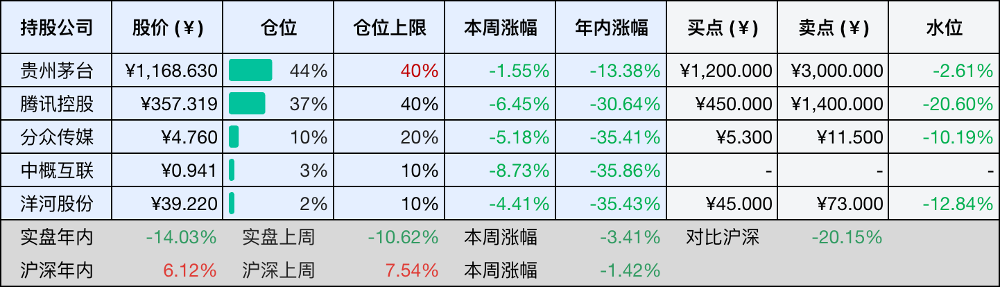
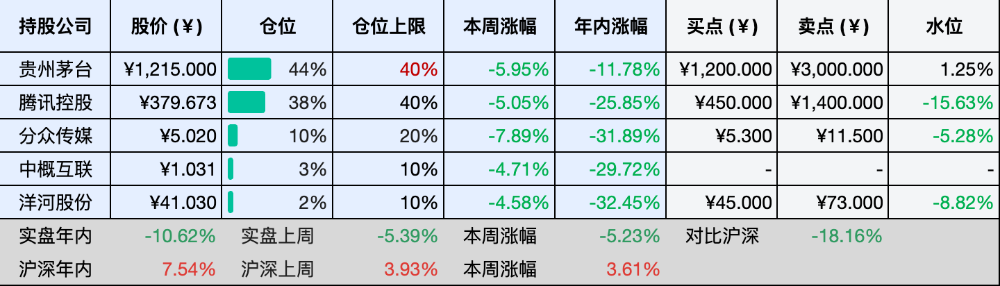
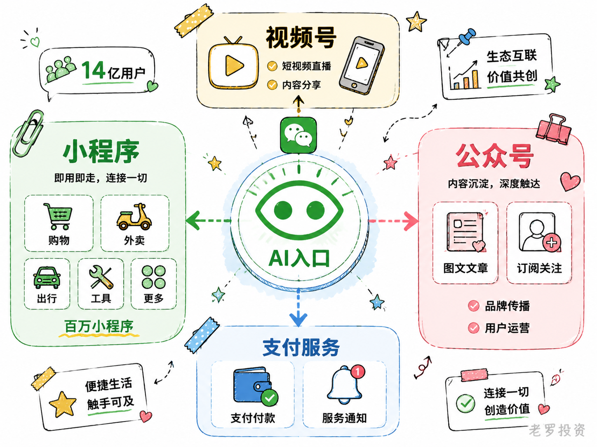
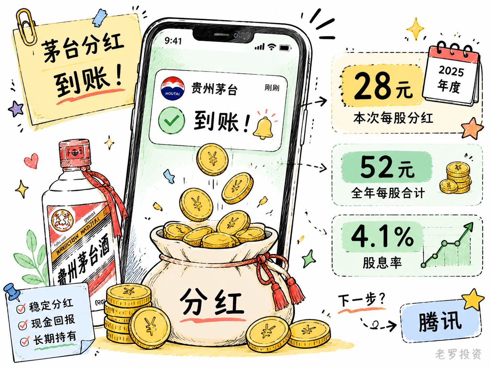

__微信公众号文章地址：[老罗投资周记-20260627](https://mp.weixin.qq.com/s/n4I9b956Wp5eSkwf-uIT0w)__

```
老罗投资周记，每周六更新。专注于股权投资、阅读、学习与个人成长，知行合一、日拱一卒、投资人生。微信公众号【老罗投资】，文章均首发于公众号。
```

## 1. 本周交易

周一(6月22日)买入恒瑞医药(600276)，买入价格为48.170元人民币。

## 2. 目前持仓

当前持有的股票包括：贵州茅台 44%、腾讯控股 37%、分众传媒 10%、中概互联 3%、洋河股份 2%。

此外还有部分现金，加上少量的恒瑞医药、海康威视、粉笔等股票，其份额较少，仅作为观察仓不进行记录。

本周投资组合整体涨跌 <span class="green">-3.41%</span>，年内收益率 <span class="green">-14.03%</span>。

1. 表格底部数据为老罗与沪深300指数年内收益率对比。
2. 港股持仓已按实时汇率换算为人民币。



## 3. 上周数据



## 4. 本周事项

+ 微信AI小微正式内测
+ 茅台分红到账

==只对持股和交易感兴趣的朋友，读到这里就可以退出了。后面是对上述事件的展开，无新内容。==

### 4.1 微信AI小微正式内测

6月20号，微信更新了8.0.75版本，部分用户发现主界面左上角多了两个小绿点，它们呈一个绿色眼睛的形状，点进去，是个叫小微的AI助手，顶部标注着测试版字样。没有发布会，也没有官方宣传，腾讯客服是在被媒体追问后才确认了这件事，微信的原生AI助手就这样低调地开始了小范围灰度测试。

入口不起眼，但覆盖的范围挺广，文字或语音都能聊，可以叫它发消息、设提醒、拨电话，也能调小程序点外卖、打车、订酒店、查快递。在聊天框、公众号文章或者视频号页面，随时呼出来，它能归纳当前内容或者回答问题。还有一个功能用起来挺顺手，用自然语言说一声，它就能生成个记账本或者BMI计算器之类的小工具，但这些功能目前只限本人使用，没法分享给别人。

小微的主模型是微信自研的WeLM，复杂任务会调用DeepSeek，但没有用腾讯此前主推的混元大模型，微信的思路像是各取所长，自研模型负责微信生态内的交互，开源模型承担通用问答。隐私边界也划得清楚，小微不会后台扫描聊天记录，只有被主动唤起时才能读取当前页面。支付、发消息这些操作需要二次确认或手动输密码，延续了微信一贯的谨慎风格。

小微内测前一周，支付宝的智能体阿宝也开启了内测，两个国民级App前后脚推出AI助手，说明AI竞赛的逻辑正在变，不只看谁能聊，更要看谁能帮用户把事情办成。微信手里最硬的牌是生态，一季度末月活14.32亿，小程序几百万个，如果这些都能被小微顺畅调用，它就是真正意义上的超级入口。

小微发布后，资本市场的反应暂时偏冷。第一个交易日腾讯跌了1.6%，后面几天继续下探，6月23号盘中跌超4%，市值一度跌破了4万亿港元。这种冷淡背后，可能反映了投资人的一些担忧，比如自研的WeLM和混元大模型是否会产生重复投入，小微全面推广后算力成本是否会侵蚀利润等，小微全面推广后算力成本可能会吃掉腾讯5%到17%的利润，而短期变现的方式还不清晰。

这些担心也有道理，小微还在测试阶段，有的媒体实测发现一些简单操作它反而做得不是很好，复杂的操作倒是还可以，点外卖的流程也不是很顺，几次确认下来比自己动手还慢。微信还给它设了不少限制，不能代发朋友圈或者视频号，不能查谁给你发了消息，也不能定时执行任务。

换个角度看，这些限制恰恰说明微信对这件事足够小心，与其等一个完美的版本，不如先放一个能用的让用户先试起来，然后再慢慢迭代。短期功能不完善、股价有波动，都不影响这件事本身的长期价值。一个能帮你干活的AI助手，再配上几百万个小程序做后盾，微信在尝试的可能是移动互联网时代以来最底层的交互方式重构，这才是刚刚开始。



### 4.2 茅台分红到账

25号晚上，茅台的分红到账了。今年茅台每股分红28块多，金额不算少，但不够再买一手茅台，钱准备下周换到腾讯那边去。

茅台的分红一直比较稳定，在现在这个市场里也算是比较确定的现金回报，今年全年每股合计大约52元，对应当前股价，股息率在4%以上，在五年期定存还只有1.5%左右的环境里，这个水平还是比较直观的。白酒行业这几年确实在调整，需求也有波动，但从结果看，公司的现金流还是能支撑住分红。

腾讯这边就完全是另一种情况，股息率本身不高，不到1%，基本可以忽略，但它的回报方式主要不在分红，而是在回购。2025年全年回购超过800亿港元，一季度又回购了76亿港元，回购之后注销股份，相当于把每一股对应的权益慢慢抬高，而且也不用交高额的分红税（港股通分红有20%的分红税）。

茅台的分红是直接拿到手的钱，比较清晰，腾讯的回购是慢慢体现在每股价值里的变化，不那么直观，但时间拉长之后会更明显。这次茅台的分红不够再买一手茅台，但换到腾讯正好可以落地，下周准备把这笔钱转过去。腾讯现在的位置很便宜，放在当前的组合里，属于可以长期放着不动的那种资产。



## 5. 本周读书

### 5.1 《体面养老：养老棋局中的亲情与算计》

一开始以为这是一本讲理财或养老产品的书，读完才发现，它更像是在讲一件更现实的事，养老不是一个人的问题，而是一整个家庭的长期博弈。

书里把养老拆成一个个故事来讲，从人生各个阶段出发，大致分成健康期、半失能期和失能期三个阶段。每个阶段会遇到什么样的照护成本、家庭分工、医疗压力，以及可能出现的冲突。

适合四十岁以上开始认真考虑养老问题的人提前看看，越早了解越主动。

评分三星半⭐️⭐️⭐️✨

## 6. 本周运动

本周运动七天，四次健走，四次抗阻训练，下周继续。

如果觉得本文还不错，那就点个赞或者在看吧，祝大家周末愉快！

```
老罗投资周记，每周六更新。专注于股权投资、阅读、学习与个人成长，知行合一、日拱一卒、投资人生。微信公众号【老罗投资】，文章均首发于公众号。
免责声明：本公众号只作为本人的投资日志记录，本文中提及的个股都有腰斩或血本无归的风险，本人不做任何投资建议，投资请坚持独立思考。
```

__微信公众号文章地址：[老罗投资周记-20260627](https://mp.weixin.qq.com/s/n4I9b956Wp5eSkwf-uIT0w)__