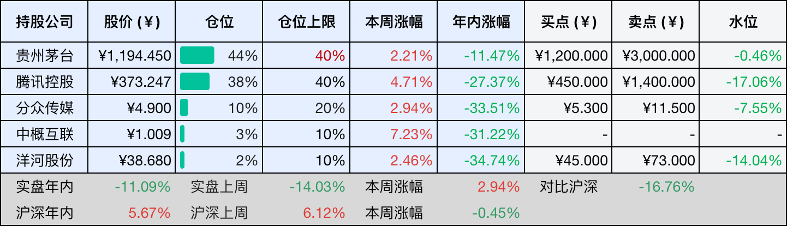
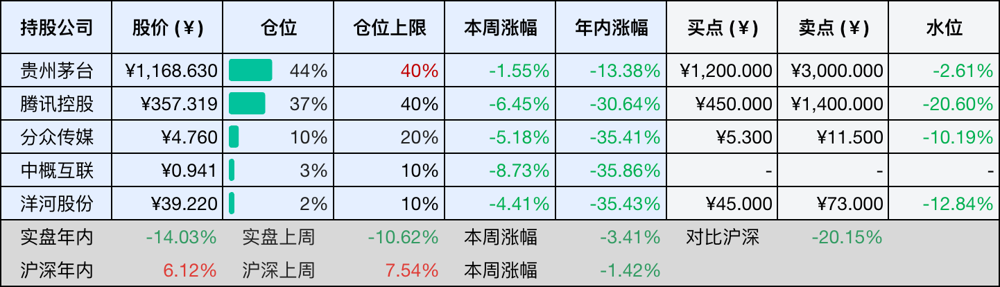
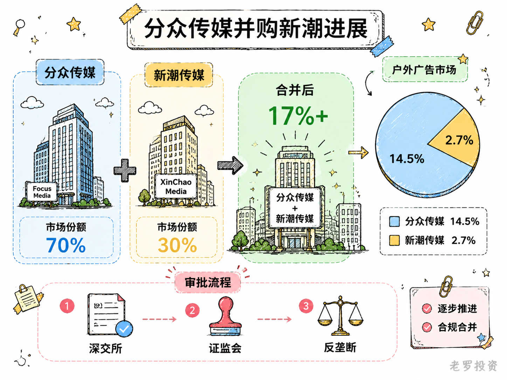
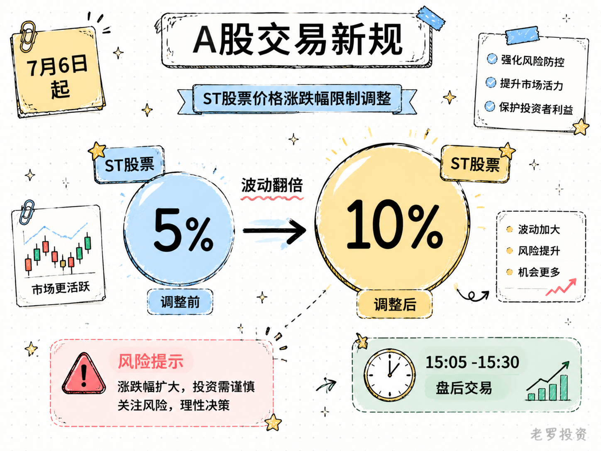

__微信公众号文章地址：[老罗投资周记-20260704](https://mp.weixin.qq.com/s/yMgc_9p8OOHxx7DEy32kBw)__

```
老罗投资周记，每周六更新。专注于股权投资、阅读、学习与个人成长，知行合一、日拱一卒、投资人生。微信公众号【老罗投资】，文章均首发于公众号。
```

## 1. 本周交易

无

## 2. 目前持仓

当前持有的股票包括：贵州茅台 44%、腾讯控股 38%、分众传媒 10%、中概互联 3%、洋河股份 2%。

此外还有部分现金，加上少量的恒瑞医药、海康威视、粉笔等股票，其份额较少，仅作为观察仓不进行记录。

本周投资组合整体涨跌 <span class="red">+2.94%</span>，年内收益率 <span class="green">-11.09%</span>。

1. 表格底部数据为老罗与沪深300指数年内收益率对比。
2. 港股持仓已按实时汇率换算为人民币。



## 3. 上周数据



## 4. 本周事项

+ 分众传媒并购新潮进展
+ A股交易新规

==只对持股和交易感兴趣的朋友，读到这里就可以退出了。后面是对上述事件的展开，无新内容。==

### 4.1 分众传媒并购新潮进展

分众传媒收购新潮传媒的事，最近又有了新进展，7月1日，分众传媒发了份公告，因为申请文件里的财务资料过了有效期，收到了深交所的中止审核通知。按此前披露的方案，分众打算用股份加现金的方式买下新潮90.02%的股份。

审计报告的基准日是2025年9月30日，有效期到2026年6月30日，过了这个时间点还没审完，按规定就得先停下来。在A股并购重组里，财务资料过期导致的中止挺常见的，算是个程序性问题，不是交易本身出了什么事。

分众的说法也挺直接，说是尽快补材料然后恢复审核，不过后面还有几道关要过：深交所审核、证监会注册、反垄断审查。每一步都存在不确定性，审批通过的时间也不好说。

这桩收购从一开始就是行业里的大事，分众在楼宇媒体市场坐了多年头把交椅，新潮是社区梯媒的主要玩家，2024年分众占户外广告市场的14.5%，新潮占2.7%，两家合并后的市占率会超过17%。新潮在全国200多座城市有约74万部智能屏，覆盖超1.8亿城市居民，这些点位和分众现有的写字楼、商圈网络正好互补。

从方案披露到现在快一年了，市场环境在变，分众的业务也在调整，2025年营收127.59亿元，微增4%，但净利润因为计提数禾科技减值大幅下滑。剔除掉这个一次性因素，主营的楼宇媒体业务仍然保持着不错的盈利能力。

财务资料过期导致的中止，更像是个时间节点上的小插曲，真正决定这笔交易能不能成的，还是后续的审批和整合方案。分众说会尽快补材料，那就看接下来几个月能不能顺利走完剩下的程序了。



### 4.2 A股交易新规

7月6日起，A股交易新规将正式实施，其中最重要的一项变化是，沪深主板ST、*ST股票的涨跌幅限制由5%调整至10%，和主板的普通股票保持一致。

这次调整涉及面不小，截至7月初，沪深主板有156家公司属于风险警示板块，除去处于退市整理期或即将摘牌的股票，仍有150只ST类股票受到影响，其中多数市值低于50亿元，相当比例的股价不足3元。这些公司多数存在生产经营、违规担保、大股东股份质押或诉讼等多重风险。

对于持有或者关注ST股票的投资者来说，最直接的变化是单日波动空间翻了一倍，原来一天最多涨跌5%，现在变成了10%。调整可能产生几个层面的影响，价格弹性增加，交易活跃度可能提升，风险和收益同步放大，但涨跌幅放宽不代表投资价值提升，风险警示股票本身仍然存在较高的退市风险。

监管层的意图很明显，统一主板各类股票的涨跌幅限制，减少板块内的机制差异，提升定价效率。深交所和上交所的表态都指向同一个方向，这不是放松监管，也不是鼓励炒作。事实上，针对风险警示股票的异常交易行为监管指标并没有改变。

还有一个同步落地的变化也值得留意，盘后固定价格交易的适用证券范围，从原来的科创板、创业板扩展至全部A股和沪深两市ETF，交易时间为每个交易日的15:05至15:30，以当日收盘价成交。这意味着每天收盘后还有25分钟可以用收盘价买卖，对中长期资金来说多了一个选择。

这次涨跌幅调整，距离2001年监管将主板ST股涨跌幅从10%收窄至5%，已经过去了整整25年，当年收窄是为了抑制过度投机，现在放宽则是为了提升定价效率。规则变了，但ST股的基本面风险没有变，波动空间大了，对投资者的判断要求只会更高。像我这种投资者，基本不会碰ST股，了解一下规则就够了。



## 5. 本周读书

### 5.1 《半小时爱上广州》

用一段零散的时间读完了这本书，像是跟着老广州走了一遍这座城市，从历史文脉到街巷方言，从早茶宵夜到经济浪潮，每一页都在刷新我的理解。

岭南自古是瘴疫之地，却因此成了千年不惊的商都，粤语里的古汉语余音、骑楼下的烟火气、孙中山屡败屡战的坚韧，都在这本书里活了起来。青山不改，绿水长流，有机会一定要亲自去看看。

评分四星⭐️⭐️⭐️⭐️

### 5.2 《湿胖》

这本书聊的是中医里的湿胖，说白了就是身体代谢不掉的多余废物堆出来的，肌肉少了容易胖，不吃碳水反而更伤脾，减湿胖不能靠寒凉泻药，得用温补的法子把代谢往上推。夜尿多是衰老的第一道信号，改善它，全身的漏水就能止住，这个视角倒是头一回见。

书里还穿插了不少实用的小细节，比如喝生理盐水保水、炒焦大米祛湿，都是能顺手用上的。读完最大的感慨是，养生这件事其实没那么玄乎，关键是把身体运行的规律搞明白，遵循着它的节奏作息生活。

评分三星半⭐️⭐️⭐️✨

### 5.3 《白发解码，从焦虑到从容的健康指南》

薄薄一本小书，翻完不费什么力气，它没堆复杂理论，只把黑发生成的原理讲清楚，顺便拆解掉那些关于白发的焦虑。怎么简单护理头皮和头发，日常怎么调整，书里也给了几条建议。

看完最大的感受，头发这事，与其瞎折腾，不如先弄明白它到底怎么长出来的，适合想养发的人翻一翻。

评分四星⭐️⭐️⭐️⭐️

### 5.4 《半小时讲透黄仁勋与英伟达》

这本书讲了黄仁勋和英伟达的崛起路径，核心就三条：避开巨头的正面战场，找准别人看不上的细分赛道先扎进去；死磕这一件事，不贪多不分散；技术再酷，也得贴着市场需求走，不做自嗨式的无用研发。

黄仁勋不是靠运气赢的，是靠着战略上的极度清醒和执行力，本书短小精悍，适合快速了解一家科技巨头的底层逻辑。

评分三星半⭐️⭐️⭐️✨

## 6. 本周运动

本周运动六天，六次健走，两次抗阻训练，下周继续。

如果觉得本文还不错，那就点个赞或者在看吧，祝大家周末愉快！

```
老罗投资周记，每周六更新。专注于股权投资、阅读、学习与个人成长，知行合一、日拱一卒、投资人生。微信公众号【老罗投资】，文章均首发于公众号。
免责声明：本公众号只作为本人的投资日志记录，本文中提及的个股都有腰斩或血本无归的风险，本人不做任何投资建议，投资请坚持独立思考。
```

__微信公众号文章地址：[老罗投资周记-20260704](https://mp.weixin.qq.com/s/yMgc_9p8OOHxx7DEy32kBw)__