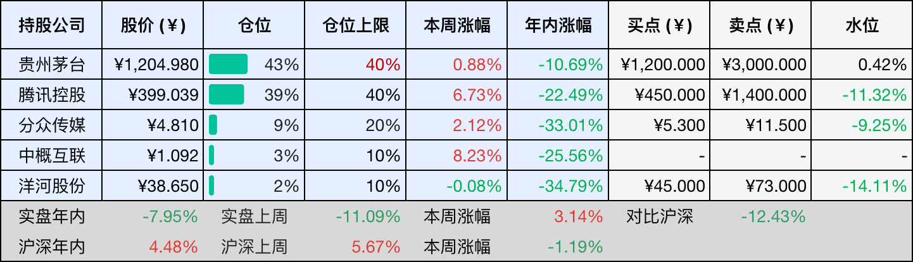
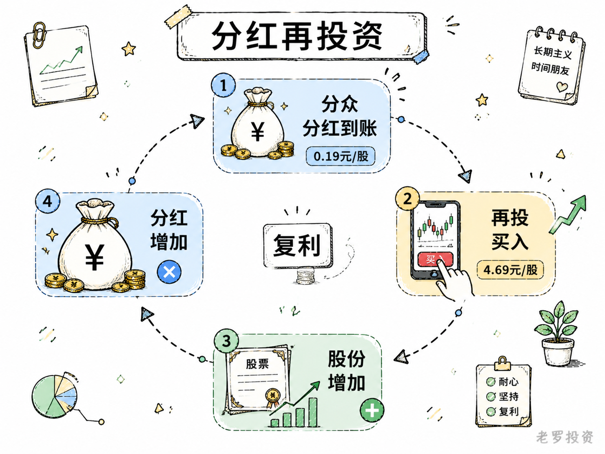
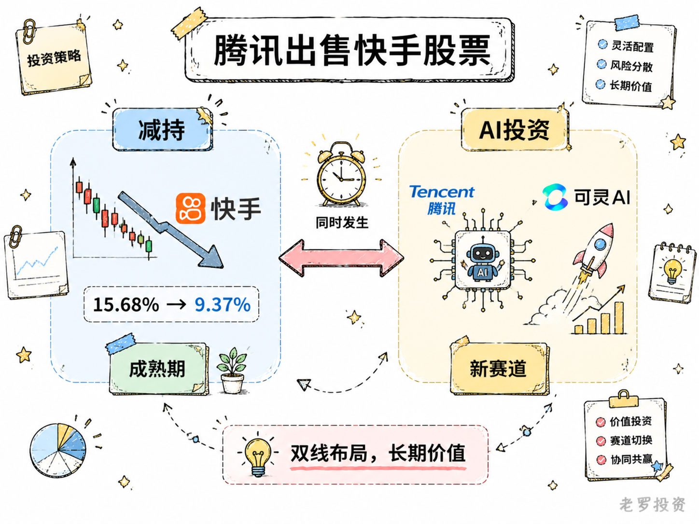
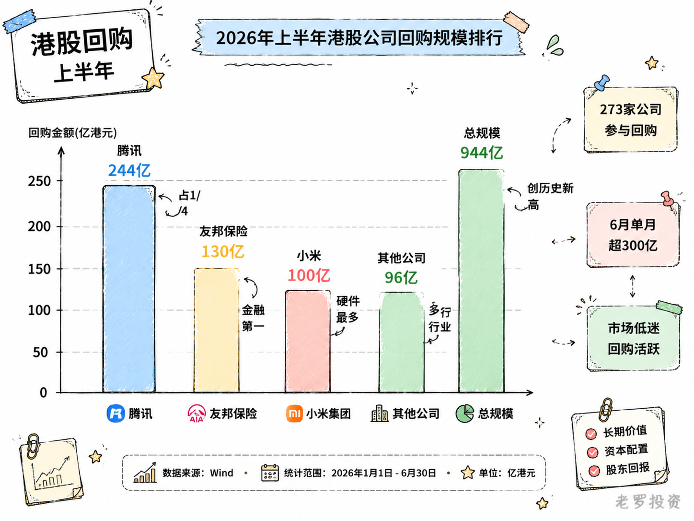

__微信公众号文章地址：[老罗投资周记-20260711](https://mp.weixin.qq.com/s/OuMkQ2wKi2uOq36dju-PJQ)__

```
老罗投资周记，每周六更新。专注于股权投资、阅读、学习与个人成长，知行合一、日拱一卒、投资人生。微信公众号【老罗投资】，文章均首发于公众号。
```

## 1. 本周交易

周四(7月9日)买入分众传媒(002027)，买入价格为4.690元人民币。

## 2. 目前持仓

当前持有的股票包括：贵州茅台 43%、腾讯控股 39%、分众传媒 9%、中概互联 3%、洋河股份 2%。

此外还有部分现金，加上少量的恒瑞医药、海康威视、粉笔等股票，其份额较少，仅作为观察仓不进行记录。

本周投资组合整体涨跌 <span class="red">+3.14%</span>，年内收益率 <span class="green">-7.95%</span>。

1. 表格底部数据为老罗与沪深300指数年内收益率对比。
2. 港股持仓已按实时汇率换算为人民币。



## 3. 上周数据


## 4. 本周事项

+ 分众传媒分红到账
+ 腾讯出售快手股票
+ 上半年港股市场回购情况

==只对持股和交易感兴趣的朋友，读到这里就可以退出了。后面是对上述事件的展开，无新内容。==

### 4.1 分众传媒分红到账

7月8号晚上，账户里多了一笔钱，分众传媒的分红到账了，每股分了0.19元，总金额不算多，但算是一笔被动收入。第二天一早就用这笔钱买入了分众，成交价4.69元，分红再投，点几下屏幕的事，不过这件事本身，倒是可以顺便聊聊对分众的一些看法。

分众的生意不算完美，楼宇媒体这行，核心的资产是电梯点位，得持续租、持续维护，不能停下来。客户结构上，对日用消费品行业的依赖一直偏重，2025年这部分收入降了16%左右。分众收入稳定性不像茅台那种公司，消费不行了客户的广告预算就会先砍，周期性比较明显。

但分众的管理层在行业里算是比较优秀的，去年行业整体一般，分众营收微增了4个点，毛利率也提升了近4个百分点。收入没怎么涨，利润却守住了，靠的是成本端一直在压，租金往下谈，低效点位关了不少，这背后是管理层在点位结构上持续的调整。

2025年净利润降了42%，主要是一次性的原因，对联营公司数禾科技提了21亿多的减值，去掉这个，主营的楼宇媒体业务其实还是很稳健的。

分众眼下还有件不确定的事，收购新潮传媒的交易，因为财务资料过期被深交所中止审核了，审计报告基准日是去年9月底，有效期到今年6月30日，过了这个点就得先停下来，补完材料再继续。在A股并购重组里，这种中止其实挺常见，属于是程序性的问题，而不是交易本身出现了问题。如果这笔交易最终落地，分众在梯媒行业的市场地位会更稳，新潮在全国有七十多万部智能屏，和分众的写字楼、商圈网络正好互补。审批流程还在走，时间上不好说，方向倒是比较明确。

回到分红这件事，每股0.19元，按4.69的买入价算，股息率大概4%，在当前这个利率环境下，已经算是相当不错了。分红再投之后，手里的股份多了，明年如果继续分红，到手的金额也会再多一点，这就是分红再投资的逻辑，一笔钱进了这个循环，就不再只是一次性的收入，而是被纳入了持续运转的体系里。

分众不是那种躺着赚钱的好生意，楼宇媒体这个行业，竞争格局、客户结构、广告主需求都在变。但管理层的应对能力、成本控制的执行力，以及在行业调整期依然保持的分红力度，让这笔投资有它自己的逻辑在。行业不景气的时候，反而是检验公司质地的时候，分众能不能在周期底部把该做的事做好，收购能不能顺利推进，这些才是更值得关注的。



### 4.2 腾讯出售快手股票

7月6日盘后，腾讯通过大宗交易卖掉了2.73亿股快手B类股，成交价43.25港元，折价6%，套现约15亿美元。持股从15.68%掉到9.37%，刚好跌破10%这条线，按港交所的规则，持股低于10%就不算主要股东了，往后减持也不用再公告。

快手第二天的7月7日跌了12%，市场主要有两个担心，一是腾讯手里还剩9个多点的股份，后面还会不会继续卖；二是股权上松绑之后，两家之前的合作默契还能不能维持。

有意思的是，在四天前的7月2号，快手旗下那个做AI视频的可灵刚完成了一轮融资，估值30亿美元，腾讯是领投方。一边在卖快手的股票，一边在投快手孵出来的公司，两件事前后脚发生。

可灵的发展还算不错，一季度营收6.5亿，同比涨了300%多，其中海外营收占了七成。当然，可灵目前还在亏钱，2025年就亏损了19亿。这种资产腾讯的一般是单独投，不跟快手母公司的估值打包在一起，过去买快手股票是把所有业务绑在一起买的，现在可灵被单独拆出来融资，腾讯就可以绕过快手的估值折价，直接拿到一张AI的船票。

腾讯减持快手这件事并不算意外，2021年底派息式清仓京东，2022年减持美团，模式都是类似的。被减持的公司已经进入了成熟期，增长空间收窄，继续守着大比例股权的意义不大。快手的情况也差不多，短视频的流量红利基本见顶了，快手2026年一季报收入同比只涨了3.4%，利润还在下滑。广告和电商这两部分核心收入都受消费周期和竞争对手的双重挤压，平台已经从增长故事变成了现金流故事。

腾讯在公告里的表态很克制，大意是说仍然看好快手的长远发展，双方的合作关系会继续维持，快手那边的回应也类似，说减持不会对经营产生重大影响。两家还是合作伙伴，只是股权上的绑定没那么紧了。



### 4.3 上半年港股市场回购情况

上半年港股回购规模接近千亿港元，一共有273家公司参与，累计回购944.27亿港元，这个规模和去年的差不多，但参与的公司更多了。年初回购比较少，2月只回购了65亿，3月开始上升，到了6月份，单月突破了300亿。港股今年整体表现一般，恒生指数跌了接近9%，恒生科技跌了18%，市场越低迷，现金流好的公司越愿意在这个位置回购。

腾讯依然是回购的主力，上半年回购244.08亿港元，差不多占了全市场的四分之一，到7月6日，腾讯年内已经回购了51次，累计256.15亿港元，7月6日当天又回购了46.5万股，耗资2.05亿。腾讯这几年的回购力度一直很大，去年全年超过800亿，今年大概率也不会少。

排名第二的是友邦保险，上半年回购超过130亿港元，是金融板块里回购最积极的，友邦年内41个交易日都有回购动作，日均超过2亿。金融公司回购的逻辑和互联网不太一样，更多是资本回报的常规操作。

第三名是小米集团，回购超过100亿港元，小米在科技硬件公司里回购最多，手机和汽车业务都在投入期，还能拿出上百亿回购，现金流状况应该不错。

排名靠前的还有中国宏桥、中通快递、吉利汽车、药明康德、泡泡玛特、快手等，前十家合计超过570亿港元。行业分布上，科技互联网依然是回购主力，腾讯、小米、快手、网易云音乐这些都在5亿以上；医药健康也参与积极，药明康德和药明生物都超过10亿；消费品牌里泡泡玛特、百胜中国、古茗等也在3亿以上。回购这件事已经不再是科技公司的专属动作了。



## 5. 本周读书

### 5.1 《半小时讲透《聪明的投资者》》

这本书不教你炒股，而是教你买公司。格雷厄姆的核心思想是：投资是建立在透彻分析、本金安全和满意回报之上的操作。书中反复强调两个关键概念：市场先生（不要被他的情绪左右）和安全边际（为你的判断留出容错空间），他将投资者分为防御型和积极型，并分别给出了清晰的资产配置方案。

读完最大的感受，投资成功的关键不在于智力，而在于性格，控制贪婪、保持理性，宁可错过，也别买错。

评分三星半⭐️⭐️⭐️✨

### 5.2 《半小时就能读完的芒格传》

这本书从芒格的小时候讲起，一直到他成为巴菲特的搭档，内容精炼但关键点都覆盖到了。芒格不是那种天生一路开挂的人，他的成功很大程度上靠的是极致的理性。书里反复提到的逆向思维和能力圈挺实用的，就是你反过来想，什么是你不该做的，然后避开那些坑。他让我印象最深的是那种知行合一的状态，脑子里装满了知识，生活中却过得极其简单。本书挺值得看一看。

评分三星半⭐️⭐️⭐️✨

## 6. 本周运动

本周运动七天，五次健走，四次抗阻训练，下周继续。

如果觉得本文还不错，那就点个赞或者在看吧，祝大家周末愉快！

```
老罗投资周记，每周六更新。专注于股权投资、阅读、学习与个人成长，知行合一、日拱一卒、投资人生。微信公众号【老罗投资】，文章均首发于公众号。
免责声明：本公众号只作为本人的投资日志记录，本文中提及的个股都有腰斩或血本无归的风险，本人不做任何投资建议，投资请坚持独立思考。
```

__微信公众号文章地址：[老罗投资周记-20260711](https://mp.weixin.qq.com/s/OuMkQ2wKi2uOq36dju-PJQ)__