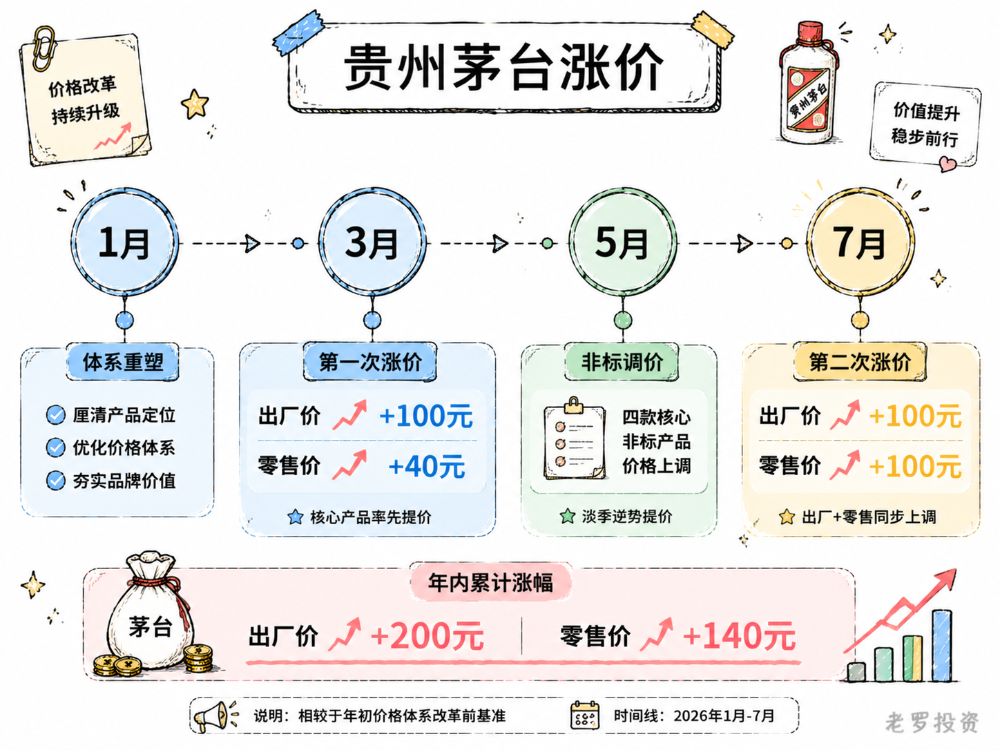
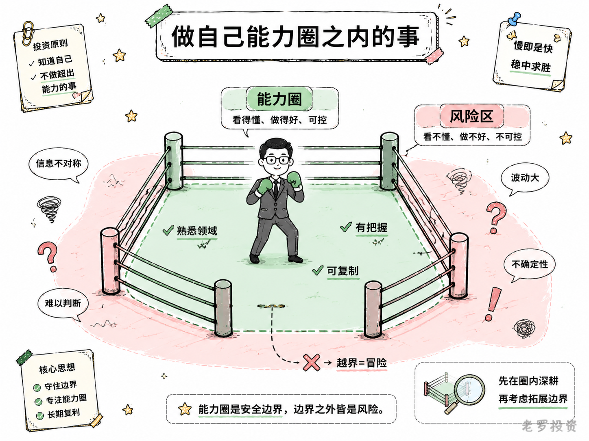

__微信公众号文章地址：[老罗投资周记-20260718](https://mp.weixin.qq.com/s/nHMinTZukHsnMb9RImOpgg)__

```
老罗投资周记，每周六更新。专注于股权投资、阅读、学习与个人成长，知行合一、日拱一卒、投资人生。微信公众号【老罗投资】，文章均首发于公众号。
```

## 1. 本周交易

无

## 2. 目前持仓

当前持有的股票包括：贵州茅台 43%、腾讯控股 38%、分众传媒 9%、中概互联 3%、洋河股份 2%。

此外还有部分现金，加上少量的恒瑞医药、海康威视、粉笔等股票，其份额较少，仅作为观察仓不进行记录。

本周投资组合整体涨跌 <span class="red">+1.87%</span>，年内收益率 <span class="green">-6.08%</span>。

1. 表格底部数据为老罗与沪深300指数年内收益率对比。
2. 港股持仓已按实时汇率换算为人民币。


## 3. 上周数据


## 4. 本周事项

+ 贵州茅台年内第二次涨价
+ 一定要做自己能力圈之内的事

==只对持股和交易感兴趣的朋友，读到这里就可以退出了。后面是对上述事件的展开，无新内容。==

### 4.1 贵州茅台年内第二次涨价

7月17日晚，贵州茅台发布公告，从7月18日零时起，飞天53%vol 500ml贵州茅台酒在i茅台平台的零售价从1539元上调至1639元，销售合同价从1269元上调至1369元。

这是茅台年内第二次上调飞天茅台价格，从2001年上市算起，茅台对飞天茅台进行过多次出厂价调整，但在一年之内两次调价，这还是头一回。上一次发生在3月底，销售合同价从1169元提到1269元，自营零售价从1499元提到1539元，两次调价间隔三个多月，节奏明显比以往快了不少。

两次调价的逻辑也不太一样，3月那一次，出厂价涨了100元，零售价只涨了40元，渠道的利润空间被压缩了，而这一次出厂和零售同步各涨了100元。两轮涨价下来，出厂价累计上调了200元，零售价累计上调了140元。

茅台为什么敢在这么短的时间内连续调价？茅台的公告里写得很清楚，依据是《2026年贵州茅台酒市场化运营方案》，原则是随行就市、相对平稳、供需适配、量价平衡，说白了，就是跟着市场需求走。

茅台以前的价格体系更像是一个静态的锚，出厂价几年调一次，零售指导价更是八年没动过，这套逻辑在白酒行业上行期没问题，但在周期波动中就显得有一点僵化。现在茅台要做的是把定价权从制度惯性中解放出来，让价格更真实地反映供需。

从市场数据看，飞天茅台的需求确实撑得住，7月中旬，500ml飞天茅台的批价在1650元到1660元之间，而调价后的i茅台零售价是1639元，即便茅台涨了价，官方渠道的价格还是比市场价便宜，消费者依然有动力在i茅台上购买。

这是茅台敢连续涨价的底气，真正的消费需求没变冷，那调价就还有空间。但从整个行业来看，茅台的涨价更像是一个孤例。截至7月15日，8家已经披露上半年业绩预告的白酒上市公司中，仅有五粮液业绩预增，其余的7家均盈利下滑或亏损，水井坊、舍得等企业还在主动控货、清理库存，行业整体仍然处于深度调整期，去库存是主旋律。

茅台选择在行业淡季调价，影响相对可控，同时，在同行普遍承压的时候涨价，也是在拉大与竞品之间的价格差距。茅台的价格是中国白酒的天花板，这次上调为行业穿越调整周期注入了信心，但也有人担心，提价不会改变行业寒冬的现实，其余名酒暂时没有同步提价的空间。

对茅台自身而言，这次调价的意义可能不止于增厚利润。从1月重塑自营零售价格体系，到3月上调飞天价格，再到5月调整非标产品，直至7月第二次上调飞天价格，价格动态调整的机制已经初步形成。茅台在价格管理上正在告别过去几年一动的节奏，走向以市场为导向的常态化调整。

这大概是茅台2026年市场化改革最核心的变化，从计划走向市价，涨不涨、涨多少，不再取决于内部决策周期，而是看市场怎么走。至于这条路能不能走通，要看下半年批价能不能稳住，也要看消费者对1639元这个新价格的接受度如何。



### 4.2 一定要做自己能力圈之内的事

邹市明夫妇创业亏损2亿这事，前阵子传得挺广，从2017年退役到2025年，七年累计亏损超过2亿元。夫妇俩卖了北京、上海、贵阳、美国四套房产还债，冉莹颖连收藏的72只爱马仕包和上千双高跟鞋都卖了两百多双。不过事情的具体来龙去脉，外人毕竟不清楚，也没必要去评判谁对谁错。但这件事确实值得想一想，财富管理这件事，有时候比赚钱本身更需要花心思。

2018年，邹市明在上海黄浦江边租下1.8万平方米的场地，开了当时上海规模最大的搏击场馆一号运动中心。年租金五千万，每天一睁眼就是十四万的房租，场馆装修砸进去六千万，一盏水晶吊灯花了三百万，一台进口跑步机二十万，连储物柜都要意大利定制。拳馆年卡定价三万八到八万八不等，私教课880一节，馆里一杯普通咖啡128块，这个价格是市场平均价的五倍还多。拳击在国内本来就是小众运动，高端付费客群更是少之又少，场馆日均客流不足百人，开了七年，84个月里83个月在亏损，长期有效会员不到30个人。邹市明自己后来也承认，花了很多不该花的钱，失败的原因是太讲情怀了，没做市场调研。

拳馆之外，夫妇俩还在多个领域同时铺开，两人名下前前后后注册了多家公司（公开信息显示冉莹颖关联24家企业，邹市明关联17家，夫妻合计关联公司超过30家），分布青少年培训、赛事运营、拳馆、餐厅、酒吧演艺中心等多个领域。看到火锅火就开高端火锅店，人均三百三十五，不到一年倒闭；看到奶茶火就搞加盟，砸五千万，十八个月全线关店；电竞、潮牌、少儿培训，哪个赛道热就往哪里扎。后来又花四千万加杠杆炒虚拟币，市场波动直接归零，加起来一亿两千万，最后连渣都不剩。再到后来，经纪合约纠纷又赔了四百万，高端赛事和商业代言也断了。一条完整的经济链看下来，外行夫妻店、重资产冒进、投机回血、流量还债，每一步都踩在了错误的时间点上。

这件事说到底，问题不在于他们不努力，也不在于不聪明，而在于做了一件远超出自己能力范围的事。拳击手在绳圈之内是王者，出了绳圈就得面对另一套规则，创业这件事并不会因为一个人的光环而自动降低难度。名人效应能吸引来第一波客流，但后续的复购率、运营成本控制、现金流管理，跟名气并没有太大的关系。手上有两个亿的时候，觉得自己什么都能做，等到全部亏掉，才反应过来自己其实不适合干这一行。

财富管理这件事，说到底不是钱多钱少的问题，而是风险边界的问题。边界以内，你对风险有判断，知道什么地方该停、什么地方能冲，边界以外，就是靠勇气和运气硬撑。那些能穿越周期的人，不是因为他们胆子更大，而是因为他们对自己能做什么、不能做什么，心中有数。

邹市明夫妇这两年也在慢慢收尾，到今年3月底，三家银行的欠款已经还清，整体还款压力降到了峰值的两成以下，目前还和六位朋友有债务关系。夫妻俩也开始每天直播十几个小时维持家庭现金流，钱亏了可以慢慢还，但有些东西一旦亏掉就很难补回来，也许一辈子也难翻身。对还在创业或投资路上的人来说，提前知道自己的能力圈在哪里，总比到了边界之外吃了大亏，要强一点。



## 5. 本周读书

### 5.1 《航海也疯狂：保安的三十年航海纪实》

在陆地上，你总觉得自己什么都可以掌控，而到了海上，风向、洋流、天气，没一样听你的。你能做的不是控制，是适应，适应不了就吐，吐完了接着适应。

评分四星⭐️⭐️⭐️⭐️

## 6. 本周运动

本周运动七天，四次健走，三次抗阻训练，下周继续。

如果觉得本文还不错，那就点个赞或者在看吧，祝大家周末愉快！

```
老罗投资周记，每周六更新。专注于股权投资、阅读、学习与个人成长，知行合一、日拱一卒、投资人生。微信公众号【老罗投资】，文章均首发于公众号。
免责声明：本公众号只作为本人的投资日志记录，本文中提及的个股都有腰斩或血本无归的风险，本人不做任何投资建议，投资请坚持独立思考。
```

__微信公众号文章地址：[老罗投资周记-20260718](https://mp.weixin.qq.com/s/nHMinTZukHsnMb9RImOpgg)__