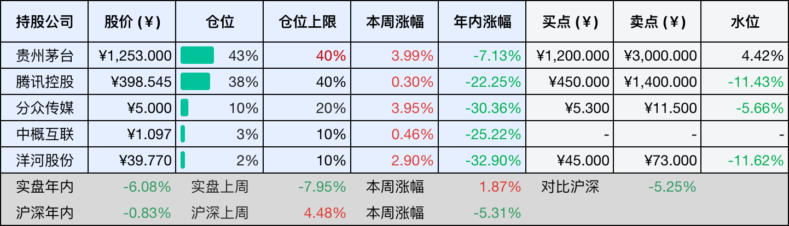
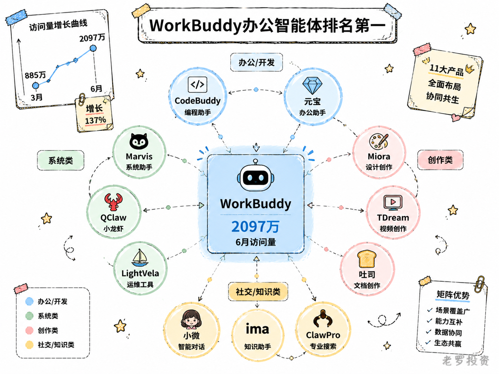
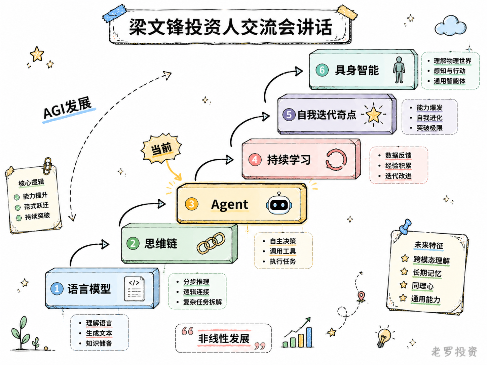
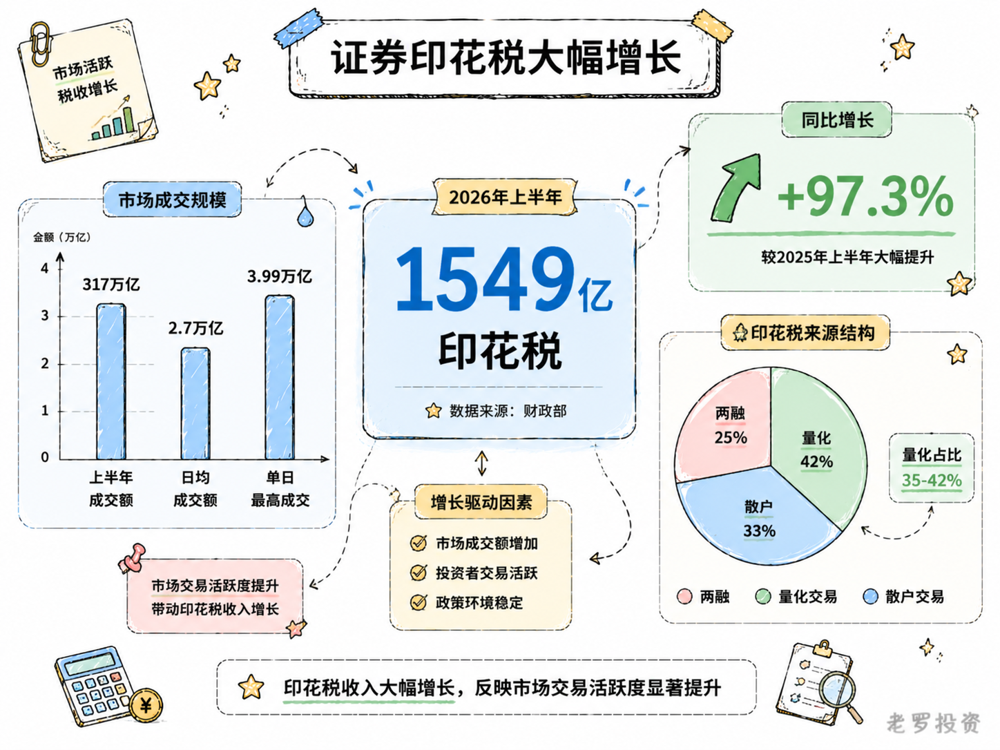

__微信公众号文章地址：[老罗投资周记-20260725](https://mp.weixin.qq.com/s/GmB6qp18PK9AHarP0YP-tA)__

```
老罗投资周记，每周六更新。专注于股权投资、阅读、学习与个人成长，知行合一、日拱一卒、投资人生。微信公众号【老罗投资】，文章均首发于公众号。
```

## 1. 本周交易

无

## 2. 目前持仓

当前持有的股票包括：贵州茅台 45%、腾讯控股 36%、分众传媒 10%、中概互联 3%、洋河股份 2%。

此外还有部分现金，加上少量的恒瑞医药、海康威视、粉笔等股票，其份额较少，仅作为观察仓不进行记录。

本周投资组合整体涨跌 <span class="green">-0.57%</span>，年内收益率 <span class="green">-6.65%</span>。

1. 表格底部数据为老罗与沪深300指数年内收益率对比。
2. 港股持仓已按实时汇率换算为人民币。


## 3. 上周数据



## 4. 本周事项

+ WorkBuddy国内PC端办公智能体排名第一
+ 梁文锋投资人交流会讲话
+ 上半年证券印花税大幅增长

==只对持股和交易感兴趣的朋友，读到这里就可以退出了。后面是对上述事件的展开，无新内容。==

### 4.1 WorkBuddy国内PC端办公智能体排名第一

7月20日发布的《2026年Q2中国办公智能体平台市场洞察报告》显示，腾讯WorkBuddy在PC端AI原生办公智能体市场6月单月访问量达到2097万次，超过第二、第三名之和。而3月这一数字仅为885万，纳入统计的17款主流办公智能体合计月访问量也从3月的2000万次增长到6月的6000万次。

不仅仅是WorkBuddy，过去几个月，腾讯以极快的节奏铺开了一张相当庞杂的产品网络：

Marvis：操作系统级个人AI助手，5月20日推出。用户通过对话即可调整系统设置、清理文件、检测硬件性能，1个主Agent加5个副Agent覆盖文件、电脑、App、浏览器、搜索五大方向，支持Windows、Mac、安卓多端互通，每人每天1000万免费Token，提供端云协同和完全本地两种模式。

QClaw（昵称小龙虾）：腾讯电脑管家团队基于OpenClaw打造，3月内测上线一周用户破数百万。核心能力是微信远程操控电脑——扫码绑定后，在任何地方通过微信发指令，QClaw即可在电脑上执行整理文件、生成报表等任务，数据全部留在本地。

LightVela：腾讯轻量云团队的云端Agent托管平台，7月15日公测。用户登录网站完成实名认证即可拥有可直接对话的Agent，6月新增技能包功能覆盖金融、开发、设计、法律、教育等9大行业场景，支持自动任务和多模型接入。与QClaw形成本地+云端的互补。

小微：微信正在灰度测试的原生AI助手，入口在微信主界面左上角，主模型为微信自研WeLM，复杂场景调用DeepSeek。能发消息、设提醒、调起小程序点外卖打车订酒店，也能对聊天框、公众号文章或视频号页面进行总结或提问，让数百万个小程序有了统一的AI调用入口。

Miora：7月22日全量上线的创意智能体，采用多AI Agent协作模式，在同一画布内完成图片、视频、3D、UI等多模态内容生成，能记住用户审美风格，将制作周期从数周缩短到数小时。

吐司（Toast）：5月15日上线的AI应用生成平台，定位低代码（Vibe Coding）产品。用户用自然语言描述想法，AI自动完成功能拆解、界面设计、逻辑编排到APK打包的全流程，7月6日iOS版上线，零代码基础的人也能生成一个可用的App。

TDream：6月开启内测的AI视频创作工具，主打互动影游化创作，五大AI引擎支持从剧本理解到视频生成的全链路，生成内容可互动、可参与。

ima：个人知识智能体，2024年11月上线，2026年推出2.0版本后成为国内首个融合Agent能力的个人知识库产品，5月25日全面开放。支持创建专属Agent，通过记忆系统持续理解用户，目前月活突破1300万，知识库文件超4.2亿个。

元宝：腾讯最早推出的个人AI助理之一，7月6日接入混元Hy3后上线Agent能力，可执行复杂任务并交付PPT、Word、Excel等文件，7月15日与京东AI Agent完成小程序生态打通。

CodeBuddy：编程智能体，覆盖编码、评审、测试、运维等研发全流程，6月与WorkBuddy同处PC端AI原生办公智能体头部阵营。

ClawPro：面向企业的AI智能体管控台，可理解为企业级的龙虾。

腾讯在AI赛道上的打法，和它在其他领域的路径很像，从来不是第一个冲上去的，但一旦看清方向，就会用极快的速度铺开一张足够密的网。WorkBuddy从3月公测到6月登顶只用了四个月，而在这四个月里，腾讯同时推出了Marvis、吐司、TDream，灰度了小微，整合了QClaw和LightVela，全量上线了Miora。这种速度不是一个团队能做到的，而是多个团队在不同方向上同时推进的结果。

AI市场足够大，大到没人能一口吞下，腾讯的布局覆盖了办公、系统、创作、开发、社交、知识管理、视频创作等多个方向，有些跑在前面，有些还在早期。整体来看，腾讯正在用矩阵式打法覆盖尽可能多的AI应用场景，这不是一场短跑，更像马拉松。腾讯最擅长的，就是在长跑中慢慢找到节奏，然后在关键节点完成超车。



### 4.2 梁文锋投资人交流会讲话

近日网上流传一份DeepSeek投资人交流会纪要，梁文锋的发言涉及面挺广，从战略到技术路线都有涉及，内容未经官方证实，但其中的判断和逻辑，可能会影响你对整个AI赛道的看法。

其中最核心的一个观点是克制，他反复提到DeepSeek只赚合理利润，不追求利润最大化。API定价的锚点是10个月收回设备成本，大约6倍利润，在这个价格区间需求没有弹性，再降价需求也不会明显增加。他认为AI最终可能占人类GDP的10%，市场大到没人能独占，想垄断就会被历史抛弃。这种克制战略，梁文锋称之为一种短期舍弃，换取长期做成AGI的更大概率。

DeepSeek的组织方式也很特别，公司没有KPI，没有考核，基本上不加班，"做正事"的时间，不超过员工时间的一半，剩下的一半用于自由探索。决策靠共识而不是一人拍板，梁文锋说自己无法单方面推动事情，必须有共识才推得下去，他在公司内的引导作用非常有限，这种极简的组织形态和克制战略是同一个逻辑。

技术路线上，梁文锋判断智能发展是阶梯式的，语言模型到思维链，再到Agent，然后是持续学习，自我迭代奇点，最后是具身智能，当前正处在Agent这个阶段。下一个明确的瓶颈是持续学习能力，他认为这是相对明确、一定能跨过的障碍，但需要时间。对于AGI的实现路径，他判断发展是非线性的，但不存在一个临界点。

关于竞争格局，梁文锋的判断比较务实。国内做大模型的公司太多了，一定会收敛到三四家，美国实际上也只有三家，资源分散是极大的浪费。

人才方面，他不认为中国缺人，问题的本质是算力，目前DeepSeek大约有2万张H系列等效力卡，大部分刚到位，正在激进扩产。美国最大模型激活参数约800B，国内还在几十B，差一个数量级。训练800B参数模型需要5万张GB300，哪怕500亿全花掉也训不起、用不起，这就是算力的硬差距。

但在国产算力和生态替代上，梁文锋表现出很乐观，他认为英伟达CUDA护城河正在快速瓦解，DeepSeek基于自研的TileLang已能用英伟达卡但不用英伟达生态，把这套在华为卡上重做一遍就能完成国产替代。华为950超节点在性能和任务上可平替英伟达GB200，价格贵50%到100%也无所谓，唯一的代价是4张华为卡顶1张英伟达卡，并且落后大约2年。他提到英伟达是在挖掘自己的坟墓，这个判断是否成立，关键看国产卡产能能不能跟上来。

关于数据和后训练，他提供了一个很少被提及的点，数据标注在中国很贵，没有成本优势，尤其是高端数据。目前一半的核心研究员在标数据，高质量数据的瓶颈在于时间而不是资本或算力。他提到语言模型Scaling目前没看到上限，DeepSeek离Scaling的墙还很远，硅谷说Scaling到头，但那只是对硅谷而言。

整场交流看下来，关于竞争终局的判断可能是最重要的，大模型公司不可能拿走大部分利润，不会有暴利，成本控制好就多赚一点。

我自己的感受是，DeepSeek走的这条路，跟巴菲特说的那种有利润之上追求的公司很像，不追求利润最大化，克制战略，组织极简，这种方式在当下激烈的AI竞赛里显得很不一样。另一个感受是，现在投资做短线交易的空间会越来越小，在量化面前，散户的胜算只会越来越低。



### 4.3 上半年证券印花税大幅增长

财政部7月22日公布了上半年财政收支数据，证券交易印花税1549亿元，同比增长97.3%。增长主要靠股市成交额撑起来的，上半年A股全市场累计成交317.5万亿元，破了半年度历史纪录，日均成交额接近2.7万亿元，比去年同期几乎翻了一倍。其中有32%的交易日成交额突破了3万亿元，1月14日那天成交了3.99万亿元，创了A股单日历史最高。

成交额为什么这么大？原因并不复杂，市场波动大，科技板块轮动快，散户进进出出的频次明显提高了。两融余额在6月23日首次突破3万亿元，比2015年的高点还高出32%，量化交易方面，一季度占比在35%到42%之间，小盘股里甚至超过了一半。

1549亿这个数字本身没什么好评价的，就是交易活跃度提升的直接结果，当前市场结构确实在变，杠杆资金的参与度高了，量化交易的比重也在不断上升，这些变化短期内可能不会逆转，至少从上半年的数据来看，交易热情还将会持续。



## 5. 本周读书

### 5.1 《低电量生活：长期疲惫怎么修复》

这本书没有那些高大上的理论，就是把疲惫拆成了一笔能量账单。让你仔细算一算，哪些事像家里的大功率电器，一开就飞速转电表。哪些事像充电宝，做完反而能给自己充上电。你可以根据自己的实际情况，试着把睡眠、吃饭、工作和社交重新排一排顺序和搭配。

读完之后，我最大的感受是，累不一定是因为事情太多，很可能只是节奏没搭配对，如果你也经常觉得身心俱疲，这本书或许能帮到你。

评分三星半⭐️⭐️⭐️✨

## 6. 本周运动

本周运动四天，一次健走，两次抗阻训练，一次健身环大冒险。本周睡眠不足，减少运动调整下状态，下周继续。

如果觉得本文还不错，那就点个赞或者在看吧，祝大家周末愉快！

```
老罗投资周记，每周六更新。专注于股权投资、阅读、学习与个人成长，知行合一、日拱一卒、投资人生。微信公众号【老罗投资】，文章均首发于公众号。
免责声明：本公众号只作为本人的投资日志记录，本文中提及的个股都有腰斩或血本无归的风险，本人不做任何投资建议，投资请坚持独立思考。
```

__微信公众号文章地址：[老罗投资周记-20260725](https://mp.weixin.qq.com/s/GmB6qp18PK9AHarP0YP-tA)__