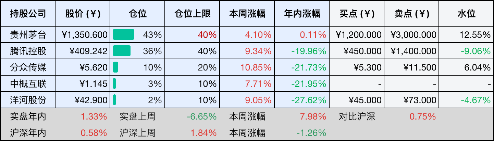
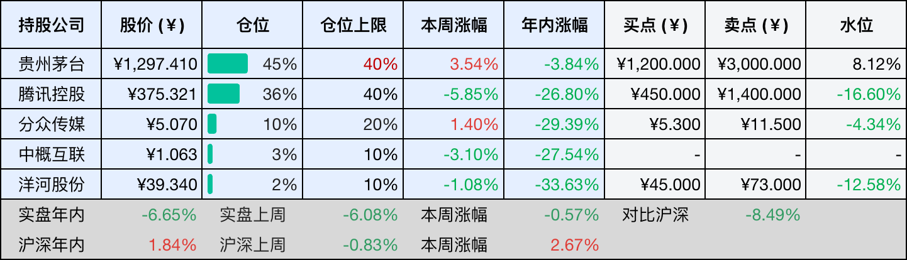
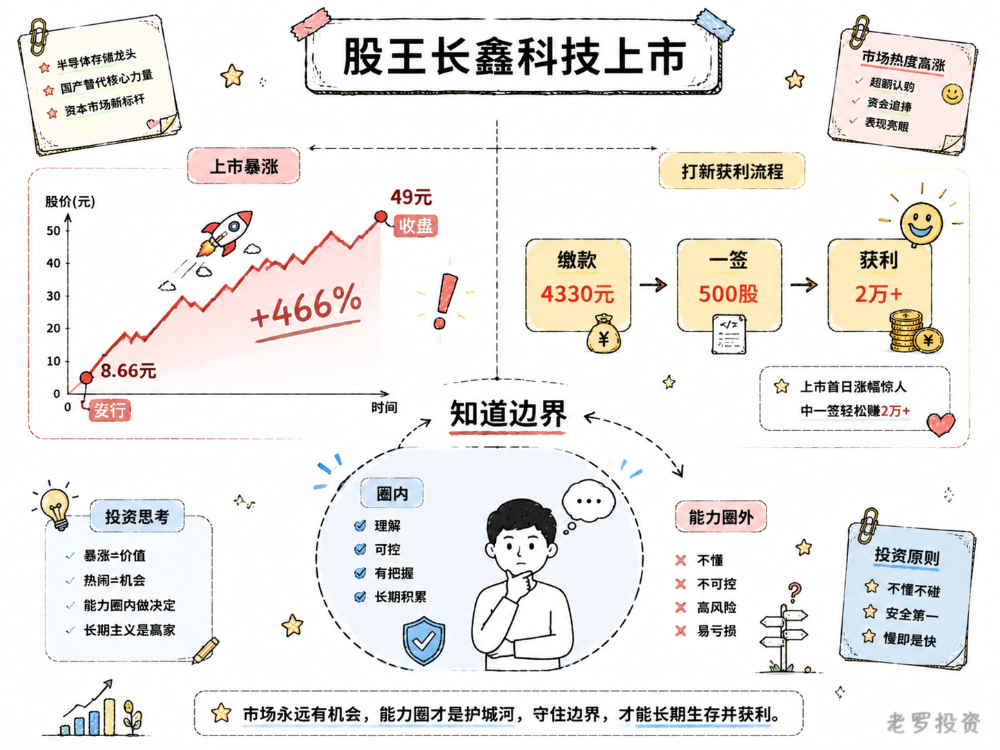

__微信公众号文章地址：[老罗投资周记-20260801](https://mp.weixin.qq.com/s/fhe3kZDGEdRyQdU0mdl4DA)__

```
老罗投资周记，每周六更新。专注于股权投资、阅读、学习与个人成长，知行合一、日拱一卒、投资人生。微信公众号【老罗投资】，文章均首发于公众号。
```

## 1. 本周交易

无

## 2. 目前持仓

当前持有的股票包括：贵州茅台 43%、腾讯控股 36%、分众传媒 10%、中概互联 3%、洋河股份 2%。

此外还有部分现金，加上少量的恒瑞医药、海康威视、粉笔等股票，其份额较少，仅作为观察仓不进行记录。

本周投资组合整体涨跌 <span class="red">+7.98%</span>，年内收益率 <span class="red">+1.33%</span>。

经过漫长的七个月时间，组合终于翻红，并反超沪深300指数。

1. 表格底部数据为老罗与沪深300指数年内收益率对比。
2. 港股持仓已按实时汇率换算为人民币。



## 3. 上周数据



## 4. 本周事项

+ 股王长鑫科技上市

==只对持股和交易感兴趣的朋友，读到这里就可以退出了。后面是对上述事件的展开，无新内容。==

### 4.1 股王长鑫科技上市

7月27日，长鑫科技登陆科创板，这只国产DRAM存储芯片龙头，发行价8.66元，开盘49.5元，收盘49元，涨幅465.82%。首日收盘市值3.28万亿元，超越工商银行，登顶A股，全天成交1411亿元，刷新了A股个股单日成交纪录。截至7月31日收盘，长鑫科技收盘价53.97元，总市值3.61万亿，盘中最高触及60.60元，市值一度突破了4万亿。

上市首日，我在49.6元和49.9元两个价位完成了卖出，一签500股，发行价8.66元，缴款4330元，按49.6元算，一签获利约2.05万元，按49.9元算，约2.06万元。

这笔打新收入算是一笔意外之财，长鑫科技确实是家好公司，全球DRAM市场年规模超过千亿美元，公司已是全球第四、中国第一的DRAM原厂。一季度营收508亿元，净利润247.62亿元，同比增长719%。但这些数字和成长逻辑，我并没有能力去判断它值不值3万亿市值。

投资的第一条纪律，就是不做能力圈之外的事，长鑫科技所在的半导体行业，技术路线复杂，周期波动剧烈，我对DRAM的产能、价格、技术迭代并没有足够的认知，对它的估值也没有把握。它的上市让我赚到了打新的钱，但我不会因为赚了这笔钱，就觉得自己看懂了这家公司。能力圈的大小不重要，重要的是知道它的边界在哪里，守住这个边界，比抓住每一个机会更重要。



## 5. 本周读书

### 5.1 《投资研习录：伯克希尔没有秘密》

这本书是以1956年到1999年巴菲特致股东信为蓝本，把那些年信里涉及投资理念的段落摘出来，结合A股的实际情况做解读。好处是帮你站在当年的场景里去理解巴菲特的思考过程，而不是把他的话当成教条来背，作者像是在跟你一起读信、一起琢磨。

读完最大的感受是，巴菲特的很多判断是在具体年份、具体市场环境里长出来的，脱离了那个背景去学，容易学走样。本书适合想认真读股东信但又怕读不懂的人。

评分四星半⭐️⭐️⭐️⭐️✨

### 5.2 《30岁后，身体降档了？》

这本书讲的是30岁后很多人都会遇到的那种状态，没生病，但就是累、容易胖、睡不好、脑子转不动。作者认为这不是年纪到了，而是原来的生活方式已经跟不上身体的新节奏。

书里把疲惫、代谢、睡眠、压力这些事拆开讲，帮你重新认识自己的身体，找到调整的方向，短小精悍，适合想弄明白自己身体到底怎么了的人翻一翻。

评分三星⭐️⭐️⭐️

### 5.3 《健康减脂》

这本书的作者刘佳，是《热辣滚烫》里贾玲减脂的体能总指导。书里讲的不是什么高深理论，就是踏踏实实的吃、练、作息，从零基础一点点调状态，减肥这件事没有什么速成诀窍，但跟着有过实战经验的人去做对的事，确实能少走不少弯路。

评分四星⭐️⭐️⭐️⭐️

## 6. 本周运动

本周运动七天，五次健走，两次抗阻训练，下周继续。

如果觉得本文还不错，那就点个赞或者在看吧，祝大家周末愉快！

```
老罗投资周记，每周六更新。专注于股权投资、阅读、学习与个人成长，知行合一、日拱一卒、投资人生。微信公众号【老罗投资】，文章均首发于公众号。
免责声明：本公众号只作为本人的投资日志记录，本文中提及的个股都有腰斩或血本无归的风险，本人不做任何投资建议，投资请坚持独立思考。
```

__微信公众号文章地址：[老罗投资周记-20260801](https://mp.weixin.qq.com/s/fhe3kZDGEdRyQdU0mdl4DA)__