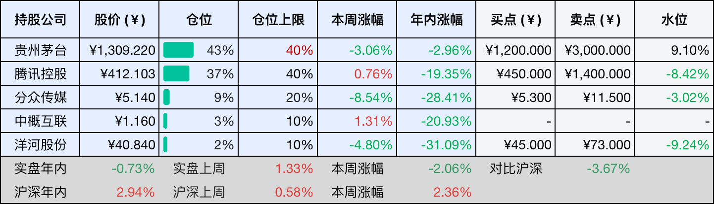
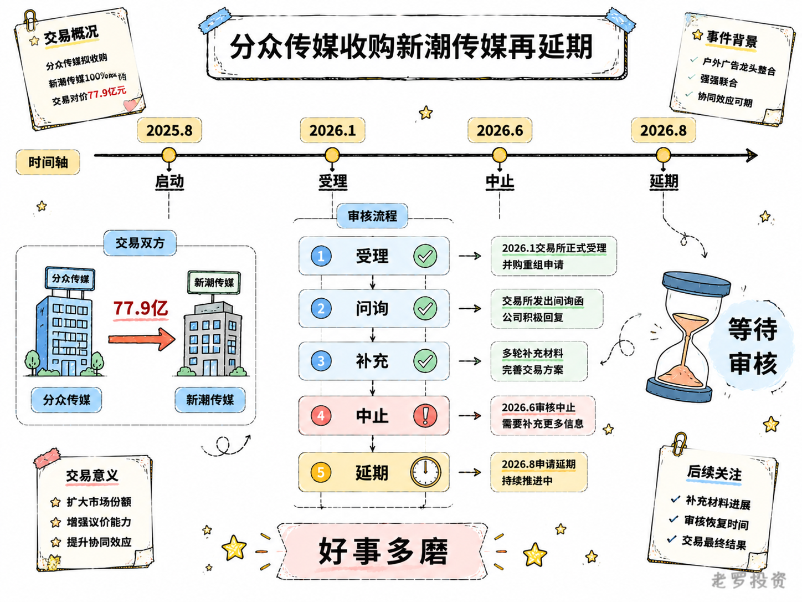
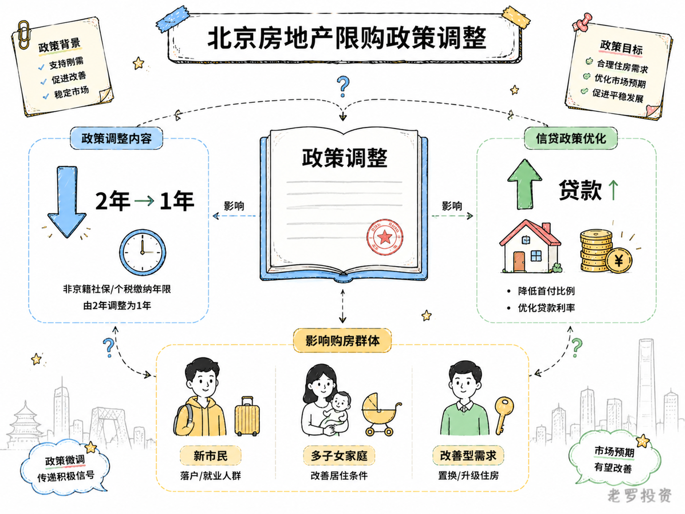

__微信公众号文章地址：[老罗投资周记-20260808](https://mp.weixin.qq.com/s/FUBHpO5s8lfzTu9oe0lOGQ)__

```
老罗投资周记，每周六更新。专注于股权投资、阅读、学习与个人成长，知行合一、日拱一卒、投资人生。微信公众号【老罗投资】，文章均首发于公众号。
```

## 1. 本周交易

无

## 2. 目前持仓

当前持有的股票包括：贵州茅台 43%、腾讯控股 37%、分众传媒 9%、中概互联 3%、洋河股份 2%。

此外还有部分现金，加上少量的恒瑞医药、海康威视、粉笔等股票，其份额较少，仅作为观察仓不进行记录。

本周投资组合整体涨跌 <span class="green">-2.06%</span>，年内收益率 <span class="green">-0.73%</span>。

1. 表格底部数据为老罗与沪深300指数年内收益率对比。
2. 港股持仓已按实时汇率换算为人民币。



## 3. 上周数据


## 4. 本周事项

+ 分众传媒收购新潮传媒再延期
+ ‌北京房地产限购政策调整

==只对持股和交易感兴趣的朋友，读到这里就可以退出了。后面是对上述事件的展开，无新内容。==

### 4.1 分众传媒收购新潮传媒再延期

分众传媒收购新潮传媒的事，又延期了。8月5日，分众传媒召开董事会临时会议，全票通过了一项议案，提请股东会将收购新潮传媒90.02%股权的交易决议有效期再延长12个月。原定有效期是从2025年8月27日临时股东会通过之日起算的12个月，今年8月27日就该到期了，现在董事会的意思是，想再延期一年。

这笔收购是2025年8月正式启动的，分众计划通过发行股份加支付现金的方式，买下新潮传媒90.02%的股权，交易对价77.94亿元。到今年8月正好满一年，但交易还没落地。

问题出在哪儿？主要是监管审核的节奏比预想中慢。今年1月9日，深交所受理了申请文件；1月23日，出具了审核问询函；3月4日，分众披露了回复内容。但深交所还有进一步的审核意见，公司需要修改补充，3月21日又申请延期回复。更大的波折在6月底，分众公告称，因申请文件中的财务资料过了有效期，审计报告基准日是2025年9月30日，有效期截止到2026年6月30日，深交所对这笔交易中止审核。公司表示这不构成实质影响，会尽快更新财务资料、申请恢复审核。

但中止审核这件事本身，已经说明了一个现实，这笔将近80亿的收购，在监管层面遇到的阻力比当初预想的要大。从受理到问询，从问询到中止，再到如今申请延长决议有效期，每一步都比预期花的时间更长。

所以这次延期的真实含义，不是分众自己不想推进，而是审批链条太长，原有的12个月有效期不够用了。董事会提请延长12个月，本质上是在为后续审核流程预留缓冲空间。8月27日，分众将召开临时股东会审议这个延期议案。

收购本身的价值暂且不论，单从推进节奏来看，这笔交易已经进入了比拼耐心的阶段，对分众和股东来说，能做的似乎只有等，好事多磨嘛。



### 4.2 ‌北京房地产限购政策调整

8月7日晚间，北京市住建委、市规自委、北京住房公积金管理中心三部门联合印发通知，宣布从8月8日起施行新一轮房地产政策调整，这是北京继去年12月之后，一年内第二次系统性地放松楼市限制。

调整的核心内容有三块：限购门槛进一步降低，非京籍家庭购买五环内商品住房，社保或个税缴纳年限从2年降到了1年，全市范围内的购房门槛统一成了1年社保。社保缴满1年的非京籍家庭，五环内可以买1套，多子女家庭可以再多买1套，五环外则不限套数。公积金贷款额度也有大幅提升，夫妻双方都缴存公积金的，首套房最高可贷240万元，二套最高200万元，符合城六区户籍居民在城六区外购房等上浮条件的，最高可以叠加上浮到340万元。房屋赠与政策同步放宽，父母把房子赠与子女，不再核验子女的购房资格。

政策出台后，市场上的一些声音认为，这对释放合理住房需求、改善市场预期有正面作用。非京籍家庭五环内购房社保年限缩短到1年，会降低新市民和年轻就业群体的安居门槛，释放一部分刚需。政策直接扩大了购房群体基数，短期内北京的新房和二手房成交量有望好转。

不过，这些判断更多是方向性的，政策的效果能持续多久，最终还是要看实际的数据变化。北京这次松绑，在限购和公积金上都做了调整，影响的群体主要是两类人，一类是社保刚满1年的非京籍潜在购房者，另一类是公积金贷款额度不足的改善型需求家庭。这两类人会不会因为政策调整而加快入市节奏，需要观察接下来几个月的网签数据。限购门槛在一步步降低，这是政策制定者对市场下行压力的逐步回应，也是对稳定房地产市场这一目标的持续落实，政策空间还有多大，取决于市场的反应和后续的数据走势。

我几年前就清空了地产相关的公司股票，当时的原因倒不是预判到了政策走向，而是觉得这个行业的商业模式和现金流特征不太容易看清。限购政策的调整对房地产行业的影响有多大，现在还很难给出一个确切的判断。成交量短期可能会有一定的回升，但价格的走势取决于供给和需求的长期平衡。北京二手房挂牌量在持续缩量，需求端政策又在放松，两者叠加之后会不会推动房价重回修复通道，这个问题的答案需要更长的时间来验证。



## 5. 本周读书

### 5.1 《你欠下的睡眠债，身体会连本带利收回去》

作者把睡眠不足的后果拆成走神、嘴馋、暴躁、忘事这些日常细节来讲，全书只有1.4万字，半个小时就能翻完，相当于读了一篇长文章，缺点是太薄了，很多话题点到为止，深度不够。

评分三星半⭐️⭐️⭐️✨

### 5.2 《日本军力的底裤》

书名取得挺唬人，内容却撑不起这个架势，全书致力于扒下日本军力的底裤，但扒到一半自己先没力气了，资料堆得不少，分析却浮在表面，像是把维基百科的词条重新排了排版。

作者立场鲜明，情绪到位，可惜论证不够硬，深度也不够。当闲书翻翻还行，想看点真东西的，恐怕要失望了，三星，不推荐。

评分三星⭐️⭐️⭐️

## 6. 本周运动

本周运动三天，两次健走，一次抗阻训练，下周继续。

如果觉得本文还不错，那就点个赞或者在看吧，祝大家周末愉快！

```
老罗投资周记，每周六更新。专注于股权投资、阅读、学习与个人成长，知行合一、日拱一卒、投资人生。微信公众号【老罗投资】，文章均首发于公众号。
免责声明：本公众号只作为本人的投资日志记录，本文中提及的个股都有腰斩或血本无归的风险，本人不做任何投资建议，投资请坚持独立思考。
```

__微信公众号文章地址：[老罗投资周记-20260808](https://mp.weixin.qq.com/s/FUBHpO5s8lfzTu9oe0lOGQ)__