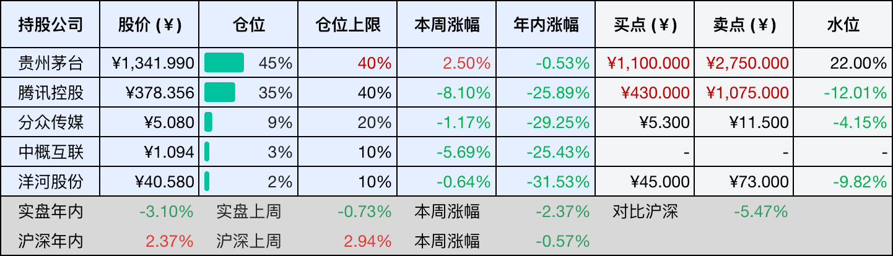
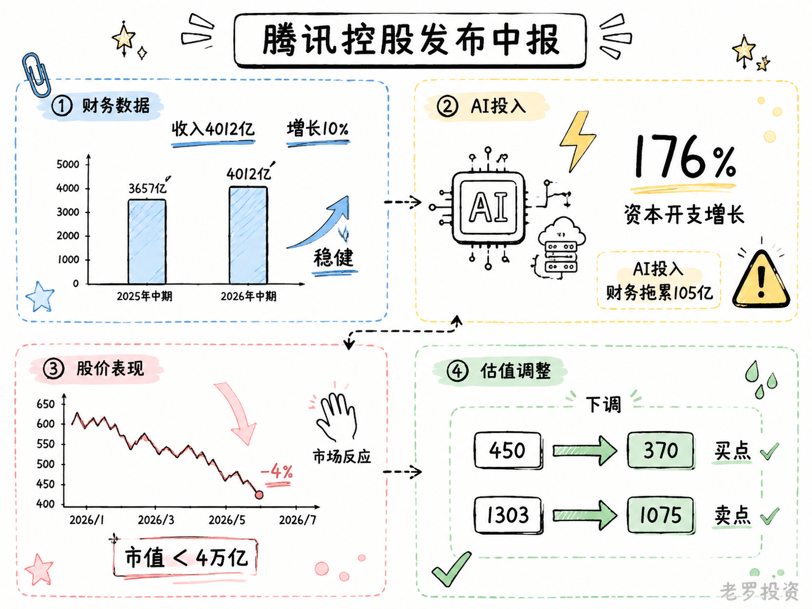
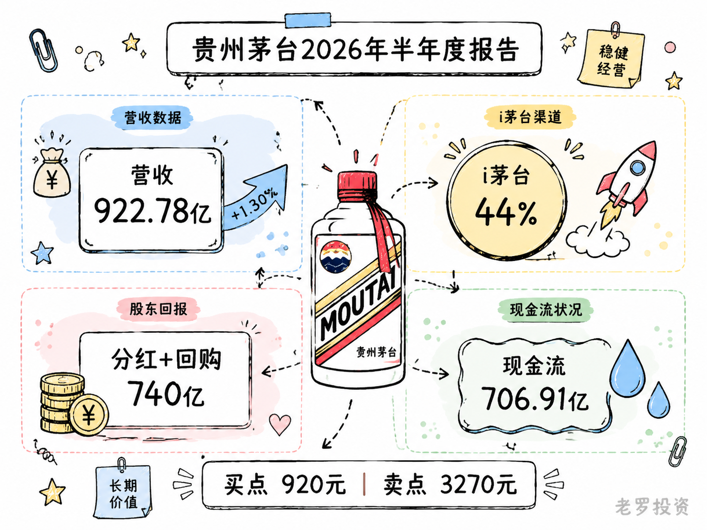

__微信公众号文章地址：[老罗投资周记-20260816](https://mp.weixin.qq.com/s/MKsTSw0jUASc_F2K6qf0TA)__

```
老罗投资周记，每周六更新。专注于股权投资、阅读、学习与个人成长，知行合一、日拱一卒、投资人生。微信公众号【老罗投资】，文章均首发于公众号。
```

## 1. 本周交易

无

## 2. 目前持仓

本周六有事，周记改成周日发布。

当前持有的股票包括：贵州茅台 45%、腾讯控股 35%、分众传媒 9%、中概互联 3%、洋河股份 2%。

此外还有部分现金，加上少量的恒瑞医药、海康威视、粉笔等股票，其份额较少，仅作为观察仓不进行记录。

本周投资组合整体涨跌 <span class="green">-2.37%</span>，年内收益率 <span class="green">-3.10%</span>。

1. 表格底部数据为老罗与沪深300指数年内收益率对比。
2. 港股持仓已按实时汇率换算为人民币。



## 3. 上周数据


## 4. 本周事项

+ 腾讯控股发布中报
+ 贵州茅台发布中报

==只对持股和交易感兴趣的朋友，读到这里就可以退出了。后面是对上述事件的展开，无新内容。==

### 4.1 腾讯控股发布中报

8月12日港股盘后，腾讯控股发布了2026年上半年未经审核的中期业绩：上半年实现收入4012.43亿元，同比增长10%；归母净利润1141.15亿元，同比增长10%，非国际财务报告准则下净利润1363.2亿元，同比增长10%。

单季度看，二季度收入2047.85亿元，同比增长11%，单季营收首次突破2000亿元。但IFRS口径下归母净利润560.22亿元，同比增幅仅0.7%，低于市场预期的584亿元。从2025年二季度约17%的增速回落至0.7%，仅一年时间。

二季度资本开支527.84亿元，同比增长了176%，环比增长65%，远超市场预期的321亿元，研发支出272.8亿元，同比增长35%，上半年合计资本开支847.2亿元。

二季度腾讯自由现金流-138亿元，这是近年来首次单季度自由现金流转负，净现金从3月末的1468.60亿元回落至581.91亿元。

财报披露后的首个交易日，腾讯股价低开低走，盘中一度下跌超过4%，总市值跌破4万亿港元。

腾讯总裁刘炽平在电话会上给出了解释，公司正在算力上进行大规模的投入，已看到明显的回报上行空间，这笔投入是今年和明年的集中性资本投入，投资者不应该假设每年都需要以同样的方式重复增加投资。新AI产品投入带来的财务拖累，由一季度的88亿元扩大至二季度的105亿元。

各业务板块表现分化比较明显，营销服务以22%的同比增速成为二季度最亮眼的板块；本土游戏收入473亿元，同比增长17%；金融科技及企业服务收入603亿元，同比增长9%。核心业务的盈利能力并没有弱化。

最后是估值调整，2025年全年Non-IFRS净利润为2596亿元，以此为基数，对未来三年净利润的假设是年均增长约2.6%，这个增速低于此前的预期，主要是考虑到AI资本开支大幅超预期，对利润的压制可能持续更长的时间。如果按照此假设，2028年的Non-IFRS净利润约为2800亿元，给一个合理市盈率25倍，对应三年后合理市值约为70000亿元，按照五折的安全边际，理想买点下调至35000亿元，买点股价约为370元人民币，一年内卖点按合理估值的150%计算，约100500亿元，对应股价约1075元人民币。

在中报发布前，我设定的买点是450元人民币，卖点是1303元人民币，中报披露后，这两个数字都做了调整，买点从450元下调至370元人民币，卖点从1303元下调至1075元人民币。买点与卖点的大幅下调，主要由于AI资本开支超出预期，对2026至2028年盈利预测的压制，还有在AI投入期，更多的不确定性因素的一个保守预估。



### 4.2 贵州茅台发布中报

8月14日，贵州茅台披露了2026年半年度报告：上半年营业总收入922.78亿元，同比增长1.30%；归母净利润445.17亿元，同比下降1.95%，基本每股收益35.57元。

分季度来看，一季度的表现要好一些。一季度营收547亿元，同比增长6.34%，净利润272亿元，同比增长1.47%。二季度单季净利润172.74亿元，环比下降约36%。利润的季节性波动是白酒行业的常态，一季度有春节旺季支撑，二季度本来就是白酒行业传统的淡季。

茅台渠道结构的变化还在继续，i茅台的表现是这份半年报里最值得看的部分。报告期内，i茅台实现酒类不含税收入402.6亿元，占总营收比重超过44%，去年同期i茅台收入215亿元，同比增幅超过了87%。如果对比一季度i茅台215亿元的收入，二季度i茅台单季贡献了约187亿元，环比略有回落，但整体占比仍然很高。飞天茅台上线i茅台满一年半，这个渠道已经从试水阶段走到了稳定放量的阶段。直销渠道占比的持续提升，也意味着茅台对终端价格的掌控力在不断增强。

贵州茅台2025年全年分红650亿元，两轮回购合计90亿元，合计超过740亿元用于股东回报。账上现金依然充裕，经营活动现金流净额706.91亿元，这种现金流状态，让茅台有足够的底气在市场波动中，维持甚至加大股东的回报力度。

回购方面，累计回购股份218.86万股并完成注销，回购总金额约30亿元，这是茅台上市以来的第二轮注销式回购。两轮注销式回购累计动用了90亿元，在A股消费类公司里算是比较少见的。回购注销直接减少总股本，提升每股收益，在利润微降的年份做这件事，对长期股东来说，是实实在在的补偿。

最后还是估值，2025年全年归母净利润823.2亿元，以此为基数，对未来三年净利润的假设是年均增长约4%。这个增速不算高，主要考虑到商务需求的恢复仍需时间，以及i茅台占比提升对毛利率的结构性影响。按此假设，2028年归母净利润约为926亿元，给一个合理市盈率25倍，对应的三年后合理市值约为23150亿元。按照五折的安全边际原则，理想买点设在合理市值的一半，约11575亿元。当前总股本约12.56亿股，对应的买点股价约为920元，一年内卖点约为3270元。

当然，利润下滑的事实也不能忽视，二季度的环比回落说明行业调整还没结束，商务需求的恢复需要时间。i茅台占比的持续提升虽然有利于长期渠道掌控，但短期内也会对毛利率产生结构性的影响。这些因素决定了茅台不太可能像前些年那样保持两位数增长，但作为一只现金流极其稳定的资产，它的价值更多体现在分红和回购带来的长期回报上。

接下来还可以关注一下8月21日的半年度业绩说明会，管理层对下半年趋势的判断、i茅台后续的投放节奏、以及第三轮回购的可能性，都是值得听的内容。在当前的价格区间，茅台处于一个不上不下的位置，不算便宜，但也不算太贵。



## 5. 本周读书

### 5.1 《不怪地球》

《不怪地球》是本挺特别的漫画集。八个短篇，意识转移、死亡循环、机械永生，设定一个比一个荒诞，但剥开科幻的壳，里面装的全是人性里的贪嗔痴，故事不长，反转却密。

评分四星⭐️⭐️⭐️⭐️

### 5.2 《日本式衰退：不增长时代的全景避坑指南》

日本用了三十五年，替我们试完了所有的错误答案。

这本书把日本经济泡沫破裂、老龄化、低欲望社会这些宏大命题，拆成十五条因果链和数十个人物故事来讲。每一章从一个人开始，到一个你今天就能用的决定结束。书末尾的十条避坑守则，不是事后总结，是别人用三十五年摔出来的地图。

读完最大的感受是：如果一个社会不再增长，你该怎么办？这个问题离我们可能并不远。

评分三星半⭐️⭐️⭐️✨

## 6. 本周运动

本周因为身体不太舒服，只运动了一天，健走了一次，下周继续。

如果觉得本文还不错，那就点个赞或者在看吧，祝大家周末愉快！

```
老罗投资周记，每周六更新。专注于股权投资、阅读、学习与个人成长，知行合一、日拱一卒、投资人生。微信公众号【老罗投资】，文章均首发于公众号。
免责声明：本公众号只作为本人的投资日志记录，本文中提及的个股都有腰斩或血本无归的风险，本人不做任何投资建议，投资请坚持独立思考。
```

__微信公众号文章地址：[老罗投资周记-20260816](https://mp.weixin.qq.com/s/MKsTSw0jUASc_F2K6qf0TA)__