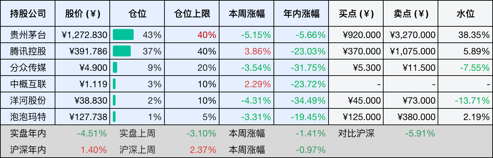
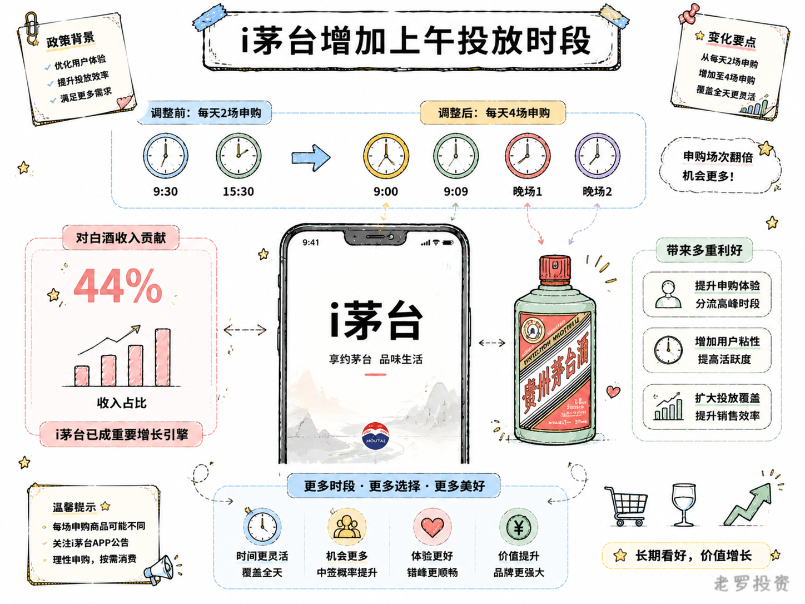
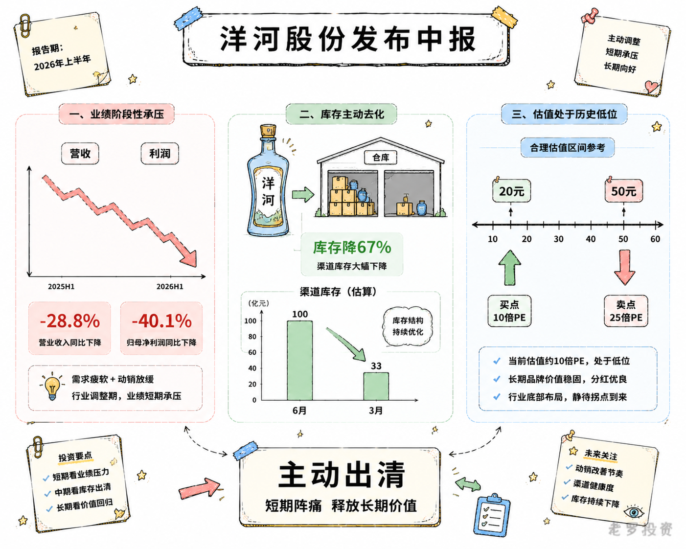

__微信公众号文章地址：[老罗投资周记-20260829](https://mp.weixin.qq.com/s/is2cOf65RnGaaRfVLI_0Lw)__

```
老罗投资周记，每周六更新。专注于股权投资、阅读、学习与个人成长，知行合一、日拱一卒、投资人生。微信公众号【老罗投资】，文章均首发于公众号。
```

## 1. 本周交易

无

## 2. 目前持仓

当前持有的股票包括：贵州茅台 44%、腾讯控股 36%、分众传媒 9%、中概互联 3%、洋河股份 2%、泡泡玛特 1%。

此外还有部分现金，加上少量的恒瑞医药、海康威视、粉笔等股票，其份额较少，仅作为观察仓不进行记录。

本周投资组合整体涨跌 <span class="red">+0.77%</span>，年内收益率 <span class="green">-3.74%</span>。

1. 表格底部数据为老罗与沪深300指数年内收益率对比。
2. 港股持仓已按实时汇率换算为人民币。


## 3. 上周数据



## 4. 本周事项

+ i茅台增加上午投放时段
+ 洋河股份发布中报

==只对持股和交易感兴趣的朋友，读到这里就可以退出了。后面是对上述事件的展开，无新内容。==

### 4.1 i茅台增加上午投放时段

从8月24日起，i茅台在原有每晚两场投放的基础上，增设了上午9点和9点09分两场申购，每天从两场变成四场，购买规则不变。

看起来只是多加了两个时间点，但放在茅台正在推进的渠道改革框架里，这个动作的意义不止于此。

i茅台从一开始就不是单纯的卖酒平台，它是茅台直营化的核心阵地，是公司直接触达消费者的主要通道。飞天茅台上线i茅台一年半以来，这个渠道已经从试水走到了稳定放量。

2026年上半年，i茅台实现酒类不含税收入402.6亿元，占总营收比重超过44%。增加投放时段，最直接的效果是扩容，申购窗口增加了一倍，更多消费者有机会在官方渠道买到平价茅台。

从消费者的角度看，一天四场申购比两场更灵活，早上和晚上的用户群体本身就存在差异，多一个时段选择就能覆盖更广的人群，这是i茅台从有得买走向买得方便的一步。从渠道博弈的角度看，官方直营渠道放量在继续扩大，当官方供给越来越充足便捷，消费者对经销渠道的依赖就会降低，茅台对终端价格的话语权也会随之增强。

从年初i茅台全面放量，到3月飞天涨价，再到5月非标产品调价和7月第二次飞天涨价，茅台的价格动态调整机制已经初步形成。i茅台作为这个机制的核心执行平台，增加投放场次是让机制运转得更顺畅的必要动作。每一次投放时段的优化，都是在为茅台掌握更多定价自主权铺路。



### 4.2 洋河股份发布中报

8月26日，洋河股份发了2026年半年度报告，上半年营收105.4亿元，同比降了28.76%；归母净利润26.02亿元，同比降了40.10%；扣非净利润24.49亿元，同比降了42.12%。洋河这份半年报，数字确实不怎么好看。

二季度下降更为明显，Q2营收23.55亿元，同比降36.86%，环比降71.23%；归母净利润只剩1.55亿元，同比降78.04%，环比降93.66%，已接近盈亏线。扣除非经常性损益后，净利润更是仅剩2118万元，意味着当季主营业务几乎不赚钱。

为什么会这样？公司在财报里提了两点：一是白酒行业还在调整，消费动能偏弱；二是洋河自己在主动控货、去库存，给经销商的回款压力也减轻了，在为第七代海之蓝换代做准备。营收与利润下降，更像是一次主动出清，而不是完全被动的下滑。

产品结构上看，上半年白酒收入103.11亿元，同比降28.86%，其中中高档酒降28.4%，普通酒降32.2%。销量降了31.4%，但吨价反而涨了3.61%，说明公司在稳价上还是下了一些功夫的。

区域分化也比较明显，省内收入43.91亿元，降38.3%；省外收入59.34亿元，降19.7%，省外降幅在减小，但省内调整力度更大。经销商数量也在减少，上半年净减538家，省外占了422家，渠道还在梳理。

毛利也在下降，上半年毛利率73.35%，同比降1.67个百分点，Q2更是降到66.19%，同比降了7个多点。费用率被动抬升得厉害，Q2销售费用率27%、管理费用率19.7%，同比分别升了6.1和8.3个百分点。收入掉了，费用降不下来，利润自然被两头夹击。合同负债也在缩小，Q2末43.04亿元，同比降26.8%。经销商打款意愿还是偏弱。

也不是完全没有改善的地方，成品酒库存从去年底的3.15万吨降到了1.05万吨，渠道库存从6个月以上压到了3个月左右，算是一个好迹象，公司正在从压货模式往终端动销驱动转，方向是对的，只是需要时间。

估值这块，2025年全年归母净利润实际是22.06亿元，但那年是极端低基数，不能直接拿来用，更合理的是以2026年预期盈利来估。以2026年预估的净利润30亿元为基数，假设未来三年（2027-2029年）净利润恢复至约35亿元（取20倍市盈率对应的700亿市值倒推，35×20=700亿），则三年后合理估值=35×20=700亿元，理想买点=700×50%=350亿元，对应股价=350÷15.06=约23元。如果以更保守的净利润33亿元、合理PE20倍计算，三年后合理估值=33×20=660亿元，理想买点=660×50%=330亿元，对应股价=330÷15.06=约22元，索性向下取整设为20元。

综合来看，买点20元对应市值约301亿元，隐含PE约10倍（301÷30）；卖点50元对应市值约753亿元，隐含PE约25倍（753÷30）。10倍PE反映的是市场对短期业绩的极度悲观，但也留出了安全边际，25倍PE对一家还在调整期的公司来说，已经不算低了。

洋河现在的处境，是行业周期和公司主动调整叠加的结果，报表确实不好看，但库存在降，渠道在改善，新产品的推进也还在继续，接下来值得关注的，是中秋国庆的动销，以及第七代海之蓝在省外能不能站住脚跟。



## 5. 本周读书

### 5.1 《野史未必假》

秦始皇的生父到底是不是吕不韦，宋太宗有没有弑兄篡位，郑和下西洋是不是为了找建文帝，雍正即位到底正不正统，书里选了22个类似的疑案，一个一个翻史料、做推理。

读着读着你会发现，传言之所以能传下来，往往因为它本身就藏着部分真相，那些写在历史书边角里的算计与不得已，比正史正文还耐看。

评分四星⭐️⭐️⭐️⭐️

## 6. 本周运动

本周运动一次，仅一次健走，下周继续。

如果觉得本文还不错，那就点个赞或者在看吧，祝大家周末愉快！

```
老罗投资周记，每周六更新。专注于股权投资、阅读、学习与个人成长，知行合一、日拱一卒、投资人生。微信公众号【老罗投资】，文章均首发于公众号。
免责声明：本公众号只作为本人的投资日志记录，本文中提及的个股都有腰斩或血本无归的风险，本人不做任何投资建议，投资请坚持独立思考。
```

__微信公众号文章地址：[老罗投资周记-20260829](https://mp.weixin.qq.com/s/is2cOf65RnGaaRfVLI_0Lw)__