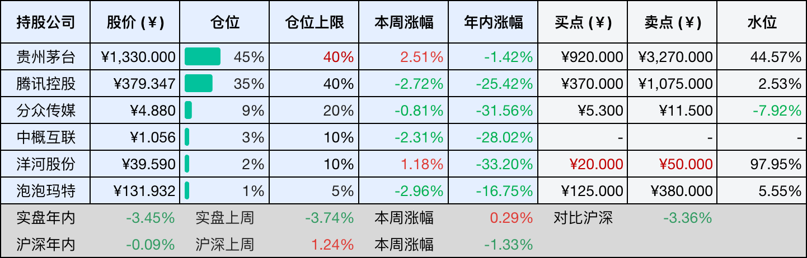
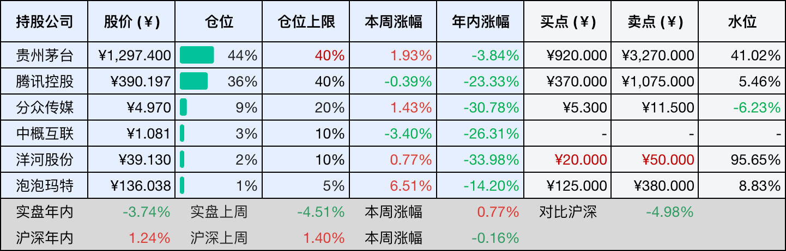

__微信公众号文章地址：[老罗投资周记-20260905](https://mp.weixin.qq.com/s/is2cOf65RnGaaRfVLI_0Lw)__

```
老罗投资周记，每周六更新。专注于股权投资、阅读、学习与个人成长，知行合一、日拱一卒、投资人生。微信公众号【老罗投资】，文章均首发于公众号。
```

## 1. 本周交易

无

## 2. 目前持仓

当前持有的股票包括：贵州茅台 45%、腾讯控股 35%、分众传媒 9%、中概互联 3%、洋河股份 2%、泡泡玛特 1%。

此外还有部分现金，加上少量的恒瑞医药、海康威视、粉笔等股票，其份额较少，仅作为观察仓不进行记录。

本周投资组合整体涨跌 <span class="red">+0.29%</span>，年内收益率 <span class="green">-3.45%</span>。

1. 表格底部数据为老罗与沪深300指数年内收益率对比。
2. 港股持仓已按实时汇率换算为人民币。



## 3. 上周数据



## 4. 本周事项

+ 分众收购进展和年中分红到账
+ 8月非农数据发布

==只对持股和交易感兴趣的朋友，读到这里就可以退出了。后面是对上述事件的展开，无新内容。==

### 4.1 分众收购进展和年中分红到账

8月28日，分众传媒向深交所提交了恢复审核的申请文件，次日就收到深交所同意恢复审核的通知。这笔交易曾经在6月份因为申请文件中的财务资料超过有效期，而被深交所中止审核，分众在8月28日披露了发行股份及支付现金购买资产报告书草案修订稿，对深交所此前的问询函做了完整回复。

8月31日晚，分众正式公告了调整后的交易方案，拟以发行股份及支付现金的方式收购新潮传媒90.02%股权，交易对价为77.94亿元，新潮传媒100%股权的评估值为83.43亿元。交易涉及到45名股东，发行价格定为每股5.06元。

按此计算，分众将向新潮原股东新增发行约15.35亿股，占发行后总股本的9.60%，现金对价部分仅2964.95万元，其余77.65亿元全部以股份支付。交易完成后，分众的股权结构会发生变化，新潮原股东将成为分众的重要股东之一。交易对价占公司2025年末归母净资产142.49亿元的54.70%，构成了重大的资产重组。

本周除了收购有了进展之外，分众还完成了2026年中期分红，根据公司8月17日董事会审议通过的方案，以总股本144.42亿股为基数，向全体股东每10股派发现金红利0.50元，合计派发7.22亿元。股权登记日为9月3日，除权除息日为9月4日，每股实际派发0.05元，在2026年上半年归母净利润31.28亿元中，分红占比约23%。分红到账的钱，打算在合适价格继续买入分众。

### 4.2 8月非农数据发布

周五，美国劳工部公布了8月份的非农就业报告：非农就业人数增加16.2万人，大幅高于市场预期的增加5.5万人，7月数据由初值的减少2.3万人修正为增加2.1万人，6月和7月合计上修5.5万人。失业率维持在4.1%，与7月持平，平均时薪环比上涨0.3%，符合市场预期。

就业增长的主要来源是休闲酒店业和地方政府教育部门，餐饮及酒吧行业当月新增5.9万个岗位，地方政府教育部门增加4.2万个，制造业增加1.6万人，建筑业增加2.2万人。医疗保健行业仅增加1.3万人，低于此前12个月月均3.2万人的增幅，信息业减少2.3万个岗位。增长集中在少数行业，并非全面扩散。

数据公布后，市场对美联储9月加息的预期明显升温，预计9月加息的概率由之前的49.4%升至58.4%。

美股三大股指期货短线下挫，现货黄金一度大跌超过2%，美国各期限国债收益率全线拉升，两年期美债收益率上升到了4.416%，是2025年1月以来的最高水平。

非农数据大幅超预期，让美联储9月的政策选择变得更加复杂，非农报告一般是议息会议前的开胃菜，下周公布的CPI数据可能成为决定9月是否加息的关键。

## 5. 本周读书

### 5.1 《人生建议：尽早解决让你不舒服的生活小事》

这本书把生活中那些隐隐不爽的小事，比作鞋里的一粒沙，如果懒得弯腰去处理，就得一路忍下去。纱窗拖了一个月才修，体检约了半年才去，动手后发现不过三五分钟，可在那之前，它们会天天盘旋在心头，像利滚利一样吃掉你的心力。书里把这类小事分作五类，给出了很具体的破局办法。读完之后最大的感受是：一身轻松不是等来的，是行动之后才有的。

评分三星⭐️⭐️⭐️

### 5.2 《大便全书》

作者辨野义己研究肠道细菌四十年，写了这本《大便全书》，他把大便称作来自身体的情书，从肠道细菌如何影响寿命、免疫力到情绪。书中提出长寿菌的概念，教你怎么通过饮食和生活习惯打造“美肠”。

评分三星半⭐️⭐️⭐️✨

### 5.3 《人生建议：不要焦虑2小时和8公里以外的事》

我们总爱脑补未来的苦情戏，结果苦了今天的自己。书中讲解了对延迟满足的过度推崇，教你如何理直气壮地享受当下。书的篇幅很短，读起来不费劲。

评分三星半⭐️⭐️⭐️✨

## 6. 本周运动

本周运动五次，全部是健走，下周继续。

如果觉得本文还不错，那就点个赞或者在看吧，祝大家周末愉快！

```
老罗投资周记，每周六更新。专注于股权投资、阅读、学习与个人成长，知行合一、日拱一卒、投资人生。微信公众号【老罗投资】，文章均首发于公众号。
免责声明：本公众号只作为本人的投资日志记录，本文中提及的个股都有腰斩或血本无归的风险，本人不做任何投资建议，投资请坚持独立思考。
```

__微信公众号文章地址：[老罗投资周记-20260905](https://mp.weixin.qq.com/s/is2cOf65RnGaaRfVLI_0Lw)__