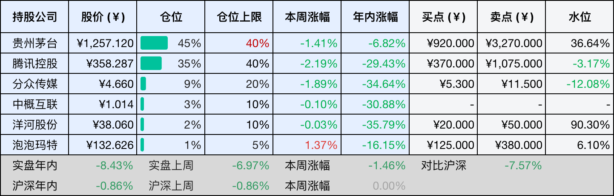
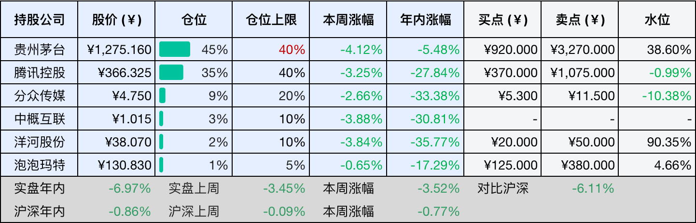
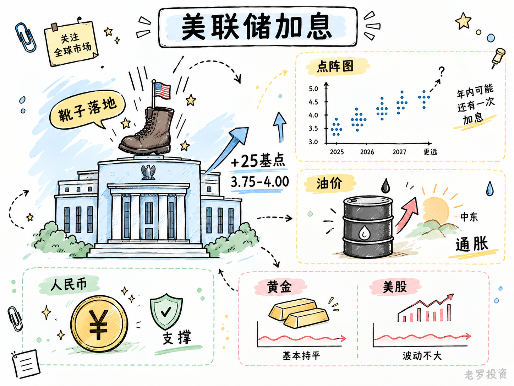
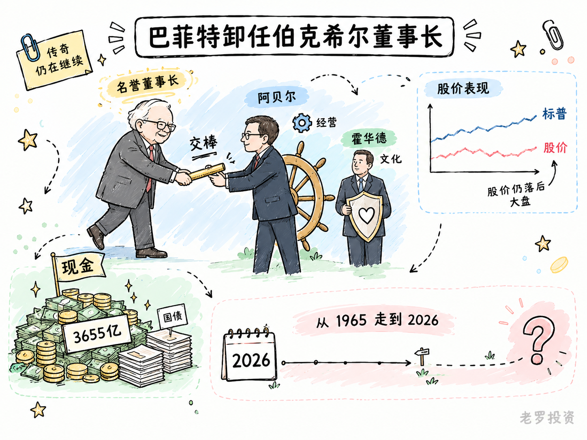

__微信公众号文章地址：[老罗投资周记-20260919](https://mp.weixin.qq.com/s/khmVzvYU2bAYVA5ooS9IJQ)__

```
老罗投资周记，每周六更新。专注于股权投资、阅读、学习与个人成长，知行合一、日拱一卒、投资人生。微信公众号【老罗投资】，文章均首发于公众号。
```

## 1. 本周交易

无

## 2. 目前持仓

当前持有的股票包括：贵州茅台 45%、腾讯控股 35%、分众传媒 9%、中概互联 3%、洋河股份 2%、泡泡玛特 1%。

此外还有部分现金，加上少量的恒瑞医药、海康威视、粉笔等股票，其份额较少，仅作为观察仓不进行记录。

本周投资组合整体涨跌 <span class="green">-1.46%</span>，年内收益率 <span class="green">-8.43%</span>。

1. 表格底部数据为老罗与沪深300指数年内收益率对比。
2. 港股持仓已按实时汇率换算为人民币。



## 3. 上周数据



## 4. 本周事项

+ 美联储加息
+ 巴菲特卸任伯克希尔董事长

==只对持股和交易感兴趣的朋友，读到这里就可以退出了。后面是对上述事件的展开，无新内容。==

### 4.1 美联储加息

9月17日凌晨，靴子落地，美联储加息了25个基点，联邦基金利率目标区间来到3.75%至4.00%，这也是2023年7月以来的首次加息。

其实市场早就有准备，会前利率期货显示，加息概率一直在七成以上，所以消息落地后，美股和黄金都没什么大反应，真正需要看的，是后面还会不会继续加息。

点阵图（美联储用来向市场传递利率预期的一个工具）给出的信号是，今年可能还有一次加息。现在最大的变量还是油价，如果中东局势继续推高油价，通胀重新起来，美联储可能继续收紧，反过来，如果局势缓和、油价回落，加息压力也会跟着减轻。

所以这次加息本身没那么重要，重要的是市场熟悉的降息预期被打断了，过去两年，大家习惯讨论什么时候降息，现在则要重新考虑资金成本维持高位的可能性。

人民币这次反应也比较平静，离岸人民币反而小幅走强，加息预期此前已经被消化，国内经济修复和出口韧性，也给人民币提供了一些支撑。汇率最终还是由多种因素共同决定，不是美联储加25个基点就能决定方向。

但利率对估值的影响还是存在，资金成本上升以后，远期利润的价值会被重新计算，现金流稳定、高分红的资产也会面对新的收益率比较。

反过来，如果一家企业已经能够产生现金流，盈利增长主要来自自身业务，而且对海外融资依赖不高，利率变化传导过来的压力就没那么直接。

所以接下来真正值得看的，还是通胀和油价，美联储年内到底加息一次还是两次，现在都很难提前下结论，市场也只能随着数据出来，一步一步重新定价。



### 4.2 巴菲特卸任伯克希尔董事长

9月18日，96岁的巴菲特正式卸任伯克希尔·哈撒韦董事长，转任名誉董事长，继续留在董事会，长子霍华德接任董事长，格雷格·阿贝尔继续担任CEO。

这场交接其实已经走了一段时间，今年1月1日，阿贝尔先接过了CEO的位置，巴菲特当时还保留董事长职务，现在连董事长也交出去，伯克希尔进入了没有巴菲特直接掌舵的阶段。

霍华德和阿贝尔两个人的分工并不一样，阿贝尔负责公司经营，霍华德负责守住文化和价值观，经营和资本配置交给阿贝尔，家族成员留在董事会里。

市场对巴菲特卸任的反应没有那么轻松，自从2025年5月巴菲特宣布卸任CEO以来，伯克希尔股价持续落后于标普500，过去投资者愿意为巴菲特的判断力支付一部分溢价，现在这部分可能需要重新评估。

伯克希尔目前倒是不缺钱，截至2026年二季度末，现金和短期美债合计约3655亿美元，钱放着也有收益，但伯克希尔过去更熟悉的事情，是在合适的时候把现金变成新的资产。

今年阿贝尔已经开始动用一部分现金，一季度回购约2.34亿美元，二季度增加到约45亿美元，上半年买入股票394亿美元，卖出278亿美元，结束了此前连续14个季度的股票净卖出。

6月，伯克希尔还通过私募方式投资Alphabet约100亿美元，动作开始多了一些，但放在3655亿美元现金面前，这些金额仍然不算特别大。

阿贝尔此前也提到，现金和国债的意义不只是收益，更重要的是让公司保留选择权力，并购、回购、买股票，或者继续等待，都需要手里有足够的现金。

巴菲特从1965年接手那家纺织厂算起，在伯克希尔已经超过六十年，现在他把经营交给了阿贝尔，自己只留在董事会和股东的位置上。

没有巴菲特的伯克希尔，将来会变成什么样？



## 5. 本周读书

### 5.1 《人人要懂的经济数据》

这本书的作者小宫一庆做了四十年经营咨询，每天必看经济数据，他写的这本《人人要懂的经济数据》，不是教人背指标定义，而是讲怎么把GDP、失业率、物价这些数字串起来看。

单独一个数据说明不了什么，但几个一关联，世界正在发生什么，就慢慢地清晰了。

书里讲的指标很杂，从整体经济到粗钢产量、日经股价都有，但读起来并不枯燥，适合想看懂财经新闻、又不想啃教科书的人。

评分三星半⭐️⭐️⭐️✨

## 6. 本周运动

本周运动四次，三次健走，一次抗阻训练，下周继续。

如果觉得本文还不错，那就点个赞或者在看吧，祝大家周末愉快！

```
老罗投资周记，每周六更新。专注于股权投资、阅读、学习与个人成长，知行合一、日拱一卒、投资人生。微信公众号【老罗投资】，文章均首发于公众号。
免责声明：本公众号只作为本人的投资日志记录，本文中提及的个股都有腰斩或血本无归的风险，本人不做任何投资建议，投资请坚持独立思考。
```

__微信公众号文章地址：[老罗投资周记-20260919](https://mp.weixin.qq.com/s/khmVzvYU2bAYVA5ooS9IJQ)__