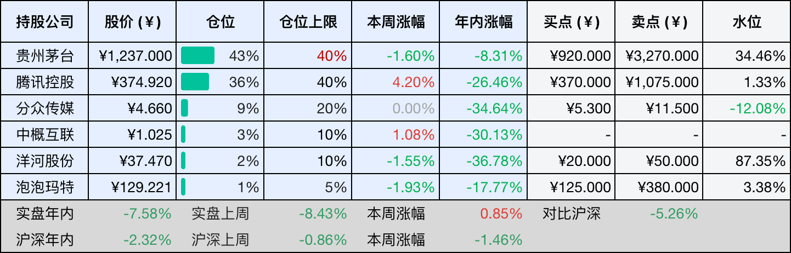
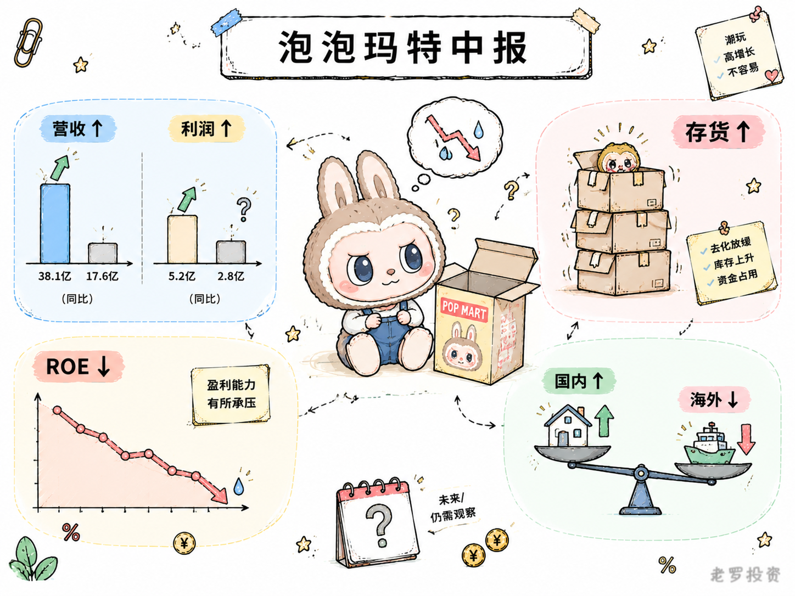

__微信公众号文章地址：[老罗投资周记-20260926](https://mp.weixin.qq.com/s/2NMk-8TyTs6FnbhWN5akGg)__

```
老罗投资周记，每周六更新。专注于股权投资、阅读、学习与个人成长，知行合一、日拱一卒、投资人生。微信公众号【老罗投资】，文章均首发于公众号。
```

## 1. 本周交易

无

## 2. 目前持仓

当前持有的股票包括：贵州茅台 43%、腾讯控股 36%、分众传媒 9%、中概互联 3%、洋河股份 2%、泡泡玛特 1%。

此外还有部分现金，加上少量的恒瑞医药、海康威视、粉笔等股票，其份额较少，仅作为观察仓不进行记录。

本周投资组合整体涨跌 <span class="red">+0.85%</span>，年内收益率 <span class="green">-7.58%</span>。

1. 表格底部数据为老罗与沪深300指数年内收益率对比。
2. 港股持仓已按实时汇率换算为人民币。



## 3. 上周数据


## 4. 本周事项

+ 泡泡玛特发布中报

==只对持股和交易感兴趣的朋友，读到这里就可以退出了。后面是对上述事件的展开，无新内容。==

### 4.1 泡泡玛特发布中报

泡泡玛特本周披露了2026年中期报告：上半年实现营业收入171.73亿元，同比增长23.76%；归母净利润50.38亿元，同比增长10.14%；平均净资产收益率22.65%，较上年同期下降了14.38个百分点。

收入增长超过两成，利润增长只有一成出头，两个数字之间的差距，指向一个老问题，赚来的钱在增加，但赚钱的效率在下降。ROE从37%左右掉到22.65%，降幅不小，这未必说明生意变差了，但一定说明资产变重了。

过去两年，泡泡玛特的门店在扩张，海外市场在铺开，仓储和物流网络也在加密。这些投入短期内会推高资产规模和费用水平，拉低ROE，问题是这些钱花出去之后，能不能换回同等甚至更高的回报。从上半年海外收入同比下滑11.6%来看，至少在部分地区，答案暂时是否定的。亚太区域下滑9.7%，美洲下滑16.5%，海外线上渠道流量红利在消退。

国内业务还算稳定，中国区营收122.01亿元，同比增长47.3%，基本盘没有松动。毛绒产品收入98.25亿元，占总营收比重升至57.2%，品类扩张还在推进。星星人IP从去年同期的3.89亿元飙升至26.50亿元，说明IP孵化能力还在，但THE MONSTERS收入从48.14亿元回落至44.54亿元，老IP的热度在退，新IP的接棒还需要时间。

上半年公司也在积极回购，于6月30日、7月2日、7月3日分别回购股份，合计耗资约14.99亿港元。截至6月末，公司现金及现金等价物约137亿元，这笔钱怎么用，一边是继续扩张海外门店和供应链，一边是回购和分红，两种用途之间需要平衡。

管理层对下半年不太乐观，CEO王宁在业绩会上提出，下半年经营压力会超过上半年，大概率完不成年初设定的20%营收增长目标。存货从54.73亿元升至61.02亿元，周转天数从123天升至201天，海外扩张带来的备货压力不小。毛利率从70.3%微降至69.7%，虽然仍处高位，但趋势在向下。

泡泡玛特现在的处境，是高速扩张之后的一次阶段性消化，海外市场在从铺量转向精耕，IP矩阵在从单一爆款转向多点开花，这些调整都需要时间。公司账上有钱，回购也在进行，基本面没有出现断裂，但ROE能不能止跌回升，海外业务什么时候恢复增长，新IP能不能真正接棒，这些问题还需要持续关注。



## 5. 本周读书

### 5.1 《图解健康系列-高血压看这本就够了》

协和医生陈罡写的图解高血压科普，畅销了十几年，全书用漫画和图解讲清血压调控、饮食、运动、用药这些事，把门诊医生没空细说的都补上了。

书里讲清了某些降压药会引起干咳或脚踝肿，以前一直以为是感冒，看了才去调药，适合家里有高血压长辈、想找本靠谱入门书的人翻一翻。

评分四星⭐️⭐️⭐️⭐️

### 5.2 《漫画经济危机》

这本书用漫画把2008年金融危机的来龙去脉讲了一遍，作者是意大利工程师兼漫画家戴维·帕斯库蒂，拿过2014年卢卡国际漫画节评审团特别奖。

书里追溯了过去十五到二十年的经济历史，分析高科技泡沫怎么破碎、银行怎么通过房地产撬动新泡沫、高风险抵押贷款怎么让全球经济如履薄冰。

评分四星⭐️⭐️⭐️⭐️

## 6. 本周运动

本周运动四次，两次健走，两次抗阻训练，下周继续。

如果觉得本文还不错，那就点个赞或者在看吧，祝大家中秋节假期愉快！

```
老罗投资周记，每周六更新。专注于股权投资、阅读、学习与个人成长，知行合一、日拱一卒、投资人生。微信公众号【老罗投资】，文章均首发于公众号。
免责声明：本公众号只作为本人的投资日志记录，本文中提及的个股都有腰斩或血本无归的风险，本人不做任何投资建议，投资请坚持独立思考。
```

__微信公众号文章地址：[老罗投资周记-20260926](https://mp.weixin.qq.com/s/2NMk-8TyTs6FnbhWN5akGg)__